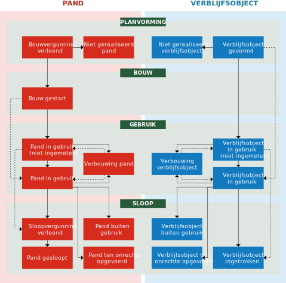

# Algemene principes

Dit hoofdstuk beschrijft algemene principes die gelden voor de inhoud van de BAG.

Deze algemene principes hebben betrekking op:

- bronhouders (zie paragraaf [[[#bronhouders]]]);
- coördinatenstelsel (zie paragraaf [[[#coordinatenstelsel]]]);
- geometrie en oppervlakte (zie paragraaf [[[#geometrie-en-oppervlakte]]]);
- relaties tussen BAG-objecten (zie paragraaf [[[#relaties-tussen-bag-objecten]]]);
- topologie (zie paragraaf [[[#topologie]]]);
- levenscyclus (zie paragraaf [[[#levenscyclus]]]);
- identificatie en historie (zie paragraaf [[[#identificatie-en-historie]]]);
- gebruiksdoel (zie paragraaf [[[#gebruiksdoel]]]).

## Bronhouders

Elke gemeente is bronhouder van de BAG binnen de eigen gemeentegrenzen. Het grondgebied van de gemeente waarop een object is gelegen, bepaalt dus welke gemeente het object registreert. Het maakt hierbij geen verschil als gerelateerde objecten in een andere gemeente liggen en daarom een andere bronhouder hebben. De nummeraanduiding wordt opgevat als eigenschap van een adresseerbaar object en geregistreerd in de gemeente waarin het adresseerbare object is gelegen. In het bijzondere geval dat een pand of verblijfsobject is gelegen op de grens van twee of meer gemeenten, worden dat pand en de eventuele verblijfsobjecten geregistreerd in de gemeente op wier grondgebied het grootste gedeelte van het pand is gelegen.

## Coördinatenstelsel

Het toegepaste coördinatenstelsel voor de BAG is dat van de Rijksdriehoeksmeting (RD-stelsel). De coördinaten zijn op de millimeter nauwkeurig en de eenheid is meter. Elk coördinaat heeft maximaal drie decimalen. Zo nodig wordt daarvoor afgerond, zodanig dat als de vierde decimaal de waarde 0, 1, 2, 3 of 4 heeft, de derde decimaal niet wijzigt en als de vierde decimaal de waarde 5, 6, 7, 8 of 9 heeft, de derde decimaal met één wordt verhoogd. Als de op te hogen decimaal de waarde 9 had (en dus 10 zou moeten worden), herhaalt deze regel zich voor de voorliggende decimalen. Bijvoorbeeld een coördinaat 155004,329098765 komt in de BAG als `155004.329` en een coördinaat 155004,329598765 als `155004.330`.

<aside class="note">Het stelsel van de Rijksdriehoeksmeting (RD) is het coördinatensysteem van Nederland. <a href="http://www.kadaster.nl/web/Themas/Registraties/Rijksdriehoeksmeting/Rijksdriehoeksstelsel.htm">http://www.kadaster.nl/web/Themas/Registraties/Rijksdriehoeksmeting/Rijksdriehoeksstelsel.htm</a></aside>

## Geometrie en oppervlakte

Deze paragraaf beschrijft algemene principes die gelden voor de inhoud van de BAG en die betrekking hebben op geometrie (zie paragraaf [[[#geometrie]]]) en op gebruiksoppervlakte (zie paragraaf [[[#gebruiksoppervlakte]]]).

### Geometrie

De geometrie is een eigenschap van vijf van de zeven BAG-objecttypen. Deze geometrie betreft het loodrechte bovenaanzicht van het object met de ware vorm, afmeting en oriëntatie en positie ten opzichte van de aarde, inclusief alle zichtbare en onzichtbare delen boven en onder de grond, maar exclusief alle delen die kunnen bewegen ten opzichte van de aarde.

De geometrische representatie van de objecttypen in de BAG, waaronder de geldige geometrietypen, de geldige ruimtelijke dimensies van de geometrie en de geldige ruimtelijke dimensies van de coördinaten van de geometrie, is afhankelijk van het objecttype (zie _$1_ 3.3.1.a).

| Objecttype | Geometrietype | Dimensie van de geometrie | Dimensie van de coördinaten |
| :---: | :---: | :---: | :---: |
| Nummeraanduiding | n.v.t. | n.v.t. | n.v.t. |
| Openbare ruimte | n.v.t. | n.v.t. | n.v.t. |
| Woonplaats | Vlak of multivlak | 2D | 2D |
| Ligplaats | Vlak | 2D | 2D |
| Pand | Vlak | 2D | 2D of 3D |
| Standplaats | Vlak | 2D | 2D |
| Verblijfsobject | Punt of vlak | 0D of 2D | 2D of 3D |

_Tabel 3.3.1.a: De geometrische representatie van de objecttypen in de BAG_

De geometrie van openbare ruimten is niet opgenomen in de BAG. De gemeente dient het bij het benoemen van nieuwe openbare ruimten alsmede bij het wijzigen van bestaande openbare ruimten een voldoende gedetailleerde omschrijving of grafische weergave op te nemen die de ligging van de buitenruimte op enigerlei wijze aanwijst. De ligging van openbare ruimten is dus wel opgenomen in het brondocument, maar niet in de BAG-registratie.

De geometrie van nummeraanduidingen is niet opgenomen in de BAG. De nummeraanduidingen worden opgevat als eigenschap van een adresseerbaar object, waarvan de geometrie wel is opgenomen in de BAG.

De geometrie van een BAG-object heeft tweedimensionale coördinaten bij de objecttypen Woonplaats, Standplaats en Ligplaats en allemaal twee- of allemaal driedimensionale coördinaten bij de objecttypen Pand en Verblijfsobject. Dit geldt voor elke geldige ruimtelijke dimensie van de geometrie. Elke vlakgeometrie moet een plat vlak zonder enige kromming (oftewel: planair) zijn, ook als deze driedimensionale coördinaten heeft.

Voor de beschrijving van geometrieën geldt het ISO 19107 Spatial Schema. Voor de uitwisseling wordt gebruik gemaakt van Geography Markup Language (GML) versie 3.1.1. In de BAG zijn de geometrieën conform het Simple Features profile versie 1.0 toegestaan [[GML-SF]]. Voor de representatie van boogvormen wordt de benadering van de boog met lineaire lijnsegmenten toegepast, de zogenaamde gestrookte boog. De geometrietypen worden in het informatiemodel met hun ISO 19107-naam aangeduid (zie tabel 3.3.1.b).

| BAG-benaming | ISO 19107-naam |
| :---: | :---: |
| Punt | `GM_Point` |
| Vlak | `GM_Surface` |
| Multivlak | `GM_MultiSurface` \|

_Tabel 3.3.1.b: De geometrietypen in de BAG_

### Gebruiksoppervlakte

De bepaling van de gebruiksoppervlakte van een verblijfsobject geschiedt conform hetgeen in NEN 2580:2007 is vastgelegd omtrent gebruiksoppervlakte. Tot de oppervlakte van een verblijfsobject wordt uitsluitend gerekend de binnenruimte, zoals gedefinieerd in NEN 2580:2007, van een dergelijk object. In afwijking van NEN 2580:2007 maken gemeenschappelijke ruimten geen onderdeel uit van de oppervlakte van een verblijfsobject. Er dienen dus geen percentages van de oppervlakte van gemeenschappelijke ruimten te worden toegerekend aan de oppervlakte van een verblijfsobject. Als basisvoorzieningen zich bevinden in een of meer nabijgelegen ondersteunende binnenruimten die geen deel uitmaken van een verblijfsobject maar wel exclusief ondersteunend zijn aan dat verblijfsobject (zie stap 2 van paragraaf [[[#x2-is-er-binnen-de-ruimte-sprake-van-aaneengesloten-samenhangend-gebruik]]]), dan tellen de gebruiksoppervlakten van deze nabijgelegen binnenruimten met basisvoorzieningen mee voor de gebruiksoppervlakte van het verblijfsobject.

## Relaties tussen BAG-objecten

De objecten in de BAG zijn onderling sterk aan elkaar gerelateerd. De relatie naar een ander object wordt gevormd door een verwijzing naar het identificerende attribuut. Bijvoorbeeld het identificerende attribuut van een woonplaats is de identificatie.

De BAG kent de volgende relaties tussen objecten:

- **Openbare ruimte**:
    Een openbare ruimte ligt in een woonplaats en heeft daartoe een verwijzing naar de gerelateerde woonplaats.

- **Nummeraanduiding**:
    Een nummeraanduiding is gelegen aan een openbare ruimte en heeft daartoe een verwijzing naar deze gerelateerde openbare ruimte. Op het moment dat een object is gelegen in een andere woonplaats dan de openbare ruimte waaraan de nummeraanduiding is gerelateerd, heeft de nummeraanduiding een verwijzing naar de gerelateerde Woonplaats. Een nummeraanduiding mag niet bestaan zonder het bijbehorende verblijfsobject of de bijbehorende standplaats of ligplaats.

- **Standplaats of ligplaats**:
    Een standplaats of ligplaats heeft één adres als hoofdadres en daartoe een verwijzing naar een gerelateerde nummeraanduiding, zijnde het hoofdadres. Een standplaats of ligplaats heeft eventueel een of meer adressen als nevenadres en in dat geval een verwijzing naar een of meer nummeraanduidingen, zijnde het nevenadres of de nevenadressen (zie paragraaf 10.2).

- **Verblijfsobject**:
    Een verblijfsobject heeft één adres als hoofdadres en daartoe een verwijzing naar een gerelateerde nummeraanduiding, zijnde het hoofdadres. Een verblijfsobject heeft eventueel een of meer adressen als nevenadres en in dat geval een verwijzing naar een of meer nummeraanduidingen, zijnde het nevenadres of de nevenadressen (zie paragraaf 10.2). Een verblijfsobject is gehuisvest in een of meer panden en heeft daartoe een verwijzing naar een of meer gerelateerde panden.

Bij een woonplaats of pand wordt geen identificatie naar een gerelateerd BAG-object opgenomen.

Panden hoeven geen verblijfsobjecten te bevatten. Op het moment dat er binnen een pand geen verblijfsobjecten aanwezig zijn (bijvoorbeeld een schuur in de tuin van een woning), zal dit dus betekenen dat er sprake is van een pand zonder daarbinnen gelegen verblijfsobjecten.

Hiermee ontstaat een situatie dat er verschillende soorten relaties tussen panden en verblijfsobjecten kunnen bestaan. Tabel 3.4.a laat zien welke situaties mogelijk zijn. In deze tabel staat _n_ voor twee of meer panden en _m_ voor twee of meer verblijfsobjecten.

| Pand | Verblijfsobject | Omschrijving |
| :---: | :---: | :--- |
| 1 | 0 | Een pand zonder verblijfsobjecten. De situatie waarin een gebouw ondersteunend is aan een hoofdgebouw en alleen als zodanig van belang is, zonder dat het een zelfstandige eenheid van gebruik is. Een pand zonder verblijfsobject heeft geen adres. |
| 1 | 1 | Een pand met één verblijfsobject. Dit is een veel voorkomende situatie bij bijvoorbeeld vrijstaande woningen en eengezinswoningen. |
| 1 | _m_ | Een pand met meerdere verblijfsobjecten. Dit is een veel voorkomende situatie bij bijvoorbeeld flatgebouwen met portiekwoningen of galerijwoningen. |
| _n_ | 1 | Een verblijfsobject dat zich uitstrekt over meerdere panden. Dit is een situatie die soms voorkomt bij bijvoorbeeld doorbraken van winkels tussen enkele panden. |
| _n_ | _m_ | Meerdere verblijfsobjecten die zich uitstrekken over meerdere panden. \|

_Tabel 3.4.a: De mogelijke relaties tussen panden en verblijfsobjecten_

Uit deze relaties volgt ook de logische volgordelijkheid van het opvoeren van BAG-objecten in de registratie van een bronhouder:

- eerst Woonplaats en/of Openbare ruimte, daarna tegelijk Nummeraanduiding van het hoofdadres met Verblijfsobject of Standplaats of Ligplaats;
- eerst Pand, daarna Verblijfsobject;
- eerst Nummeraanduiding van het hoofdadres, daarna Nummeraanduidingen van eventuele nevenadressen.

De logische volgordelijkheid voor het afvoeren van BAG-objecten is andersom.

De nummeraanduidingen van eventuele nevenadressen ontstaan tegelijk met het hoofdadres of later en mogen worden afgevoerd terwijl het Verblijfsobject, de Standplaats of de Ligplaats blijft bestaan.

Voor de relatie tussen Pand en Verblijfsobject geldt dat de administratieve relatie leidend is boven de ruimtelijke relatie (zie paragraaf 3.5).

Voor de verwijzing naar een Woonplaats geldt dat de ruimtelijke relatie leidend is boven de administratieve relatie.

## Topologie

Topologie beschrijft de onderlinge ruimtelijke relaties tussen de objecten, onafhankelijk van hun werkelijke positie (coördinaten). Een voorbeeld is dat een object gepositioneerd is in een ander object: 'ligt in' is dan de topologische relatie.

De BAG kent de volgende topologische relaties:

- **Pand en verblijfsobject**:
    Verblijfsobjecten maken altijd deel uit van een pand (of van meerdere panden). Een verblijfsobject moet daarom volledig binnen de een of meer panden worden gepositioneerd waarbinnen het zich bevindt. Als een verblijfsobject een puntgeometrie heeft, mag deze punt binnen het pand op een willekeurige plek staan.

- **Woonplaats en openbare ruimte**:
    Openbare ruimten moeten altijd volledig zijn gelegen binnen één woonplaats. Als een openbare ruimte door het splitsen van een woonplaats in meerdere woonplaatsen komt te liggen, wordt de openbare ruimte in elk van deze woonplaatsen afgebakend.

- **Woonplaats**:
    Het gehele grondgebied van de gemeente dient te zijn ingedeeld in woonplaatsen. De geometrieën van de woonplaatsen dienen naadloos op elkaar aan te sluiten en mogen elkaar niet overlappen, oftewel de geometrische vereniging van iedere woonplaats binnen een gemeente komt overeen met de geometrische contour van het grondgebied van deze gemeente.

## Levenscyclus

De levenscyclus van een BAG-object beschrijft de opeenvolgende fasen in de ontwikkeling van een object. Hierbij dient de werkelijkheid zoveel mogelijk in de registratie zichtbaar te zijn. In de verschillende fasen zijn er situaties die aanleiding geven tot het wijzigen van de gegevens van het object. De fase van ontwikkeling waarin een BAG-object zich bevindt, wordt met een eigenschap _status_ bij het object geregistreerd.

In de levenscyclus van een pand en verblijfsobject wordt in hoofdlijnen een onderscheid gemaakt tussen de vier fasen planvorming, bouw, gebruik en sloop. Binnen deze fasen kunnen verschillende statussen aan het object worden toegekend. De levenscyclus van een pand of een verblijfsobject volgt meestal een logische volgorde van statussen (zie [[[#statusvolgorde]]]), maar fasen in de levenscyclus mogen ook worden overgeslagen.

<figure id="statusvolgorde">
    
    <figcaption>De logische volgordelijkheid van de ontwikkeling en status van panden en verblijfsobjecten</figcaption>
</figure>

In de levenscycli van standplaatsen, ligplaatsen, openbare ruimten, nummeraanduidingen en woonplaatsen wordt onderscheid gemaakt tussen het benoemen en het intrekken van deze objecten.

Binnen een fase van de levenscyclus kunnen attributen worden gewijzigd, zoals het _gebruiksdoel_ bij een verblijfsobject of de geometrie van een pand.

Verder gelden de volgende regels voor het toewijzen van een status aan een object:

1. Indien voor een pand met de status `Bouwvergunning verleend` of `Bouw gestart` een nieuwe omgevingsvergunning wordt verleend, worden wel de gegevens van het pand gewijzigd conform de omgevingsvergunning, maar de status van het pand blijft ongewijzigd.
1. Indien:
    - een pand de status `Pand in gebruik (niet ingemeten)` of `Pand in gebruik` heeft bereikt, kan de status van het pand niet meer terug naar `Bouwvergunning verleend` of `Bouw gestart`, tenzij sprake is van een ten onrechte toegekende status.
    - een verblijfsobject de status `Verblijfobject in gebruik (niet ingemeten)` of `Verblijfsobject in gebruik` heeft bereikt, kan de status van het verblijfsobject niet meer terug naar `Verblijfsobject gevormd`, tenzij sprake is van een ten onrechte toegekende status.
1. Elke statusovergang is toegestaan, mits deze een correctie betreft van een ten onrechte toegekende status.
1. Als een vergunning wordt verleend voor de verbouwing van een pand en/of verblijfsobjecten, krijgen het pand en/of verblijfsobjecten die als gevolg van deze verbouwing als zodanig zullen blijven bestaan, maar waarvan een of meer gegevens in de BAG zullen wijzigen, de status `Verbouwing pand` of `Verbouwing verblijfsobject`. Als de verbouwing is afgerond, krijgt het pand de status `Pand in gebruik (niet ingemeten)` of `Pand in gebruik`, en de verblijfsobjecten de status `Verblijfsobject in gebruik (niet ingemeten)` of `Verblijfsobject in gebruik`.
1. Als een vergunning wordt verleend voor het splitsen of samenvoegen van verblijfsobjecten, worden de nieuw te realiseren Verblijfsobjecten worden opgenomen met de status `Verblijfsobject gevormd`, terwijl de 'oude' Verblijfsobjecten hun status tijdens de verbouwing behouden (meestal `Verblijfsobject in gebruik`). Als de verbouwing is afgerond, worden de 'oude' Verblijfsobjecten ingetrokken, terwijl de nieuwe Verblijfsobjecten de status `Verblijfsobject in gebruik (niet ingemeten)` of `Verblijfsobject in gebruik` krijgen zodra zij gebruiksgereed zijn.
1. Als een vergunning wordt verleend voor het toevoegen van verblijfsobjecten aan bestaande panden of een verbouwing waarbij het aantal verblijfsobjecten verandert, worden nieuwe Verblijfsobjecten opgenomen met de status `Verblijfsobject gevormd`.
1. Bij een verbouwing op een pand krijgen de eventueel aanwezige Verblijfsobjecten de status `Verbouwing verblijfsobject`, ongeacht of de pandcontouren wijzigen. Als de pandcontouren wijzigen, krijgt het Pand de status `Verbouwing pand`.
1. Indien er meerdere verbouwingen aan een pand worden verricht, krijgt het pand na voltooiing van de laatste verbouwing de status `Pand in gebruik (niet ingemeten)` of `Pand in gebruik`.
1. Indien de geometrie van een pand of verblijfsobject is ingemeten voordat de bouw is afgerond en er geen nieuwe geometrie hoeft te worden ingemeten, krijgt het pand of verblijfsobject meteen de status `Pand in gebruik` of `Verblijfsobject in gebruik` zodra het gereed is voor gebruik na afronding van de bouw.
1. Indien een verblijfsobject de status `Verblijfsobject in gebruik (niet ingemeten)` heeft gekregen, krijgen ook de een of meer panden waarin het verblijfsobject is gelegen, de status `Pand in gebruik (niet ingemeten)`.
1. Indien in een vergund pand met meerdere verblijfsobjecten een of meerdere verblijfsobjecten de status `Verblijfsobject in gebruik (niet ingemeten)` of `Verblijfsobject in gebruik` krijgen, dan krijgt het pand meteen de status `Pand in gebruik (niet ingemeten)`, respectievelijk `Pand in gebruik`.
1. De status `Sloopvergunning verleend` is zowel van toepassing op situaties waarin specifiek voor het betreffende pand een sloopvergunning is verleend, als op situaties waarin op grond van andere regelgeving geen sloopvergunning nodig is (omdat deze andere regelgeving daarmee in wezen al vergunning heeft verleend).
1. Indien een object de status `niet gerealiseerd`, `ten onrechte opgevoerd`, `gesloopt` of `ingetrokken` heeft, is het feitelijk beëindigd en kan de status niet meer worden gewijzigd. Alleen objecten die ten onrechte een van deze statussen hebben gekregen, kunnen middels een schriftelijke verklaring herleven.
1. Bij elke mutatie wordt de actuele status toegekend. Muteren in het verleden is niet toegestaan.

## Identificatie en historie

Deze paragraaf beschrijft algemene principes die gelden voor de inhoud van de BAG en die betrekking hebben op identificatie (zie paragraaf [[[#identificatie]]]) en op historie (zie paragraaf [[[#historie]]]).

### Identificatie

Aan elk object wordt een uniek objectnummer (_identificatie_) toegekend. Zolang het object bestaat, mag deze identificatie niet veranderen.

Bij splitsing van een woonplaats of openbare ruimte wordt alleen een daardoor nieuw ontstane (oftewel niet reeds aanwezige) woonplaats of openbare ruimte van een nieuwe identificatiecode voorzien. Dat aan een nieuw ontstaan object een identificatiecode wordt toegekend, volgt uit artikel 19, eerste lid, van de wet en het gewijzigde artikel 10 van het besluit. Een bij splitsing betrokken reeds bestaande woonplaats of openbare ruimte wordt niet geacht op te houden te bestaan, maar ondergaat alleen een wijziging van de geometrie. Bij samenvoeging van twee woonplaatsen of openbare ruimten houdt de ene daarbij betrokken woonplaats of openbare ruimte op te bestaan en wijzigt de geometrie van de andere woonplaats of openbare ruimte. Bij dat laatste bekijkt de gemeente per geval welk betrokken object logischerwijs geacht wordt voort te bestaan en welk object verdwijnt.

<aside class="note" title="artikel 19" id="3-7-1-iii">
Wet basisregistraties adressen en gebouwen, artikel 19, eerste lid: "In de basisregistratie worden een identificerend objectnummer, beschrijvende gegevens, temporele gegevens en meta-gegevens opgenomen over de in de gemeente bestaande: a. panden; b. verblijfsobjecten; c. standplaatsen, alsmede situaties als bedoeld in artikel 2, tweede lid, onderdeel b, aanhef en onder 1°; d. ligplaatsen, alsmede situaties als bedoeld in artikel 2, tweede lid, onderdeel b, aanhef en onder 2°; e. woonplaatsen, alsmede situaties als bedoeld in artikel 2, tweede lid, onderdeel b, aanhef en onder 3°; f. openbare ruimten, alsmede situaties als bedoeld in artikel 2, tweede lid, onderdeel b, aanhef en onder 4°, en g. nummeraanduidingen, alsmede situaties als bedoeld in artikel 2, tweede lid, onderdeel b, aanhef en onder 5°." <a href="https://zoek.officielebekendmakingen.nl/stb-2017-60.html">https://zoek.officielebekendmakingen.nl/stb-2017-60.html</a>
</aside>

<aside class="note" title="wijziging artikel 10" id="3-7-1-iv">
Wet van 10 februari 2017 tot wijziging van de Wet basisregistraties adressen en gebouwen en enige andere wetten in verband met modernisering en vereenvoudiging van de registratie en het toezicht, artikel I, onderdeel Q, onder 19, eerste lid: "In de basisregistratie worden een identificerend objectnummer, beschrijvende gegevens, temporele gegevens en meta-gegevens opgenomen over de in de gemeente bestaande: a. panden; b. verblijfsobjecten; c. standplaatsen, alsmede situaties als bedoeld in artikel 2, tweede lid, onderdeel b, aanhef en onder 1°; d. ligplaatsen, alsmede situaties als bedoeld in artikel 2, tweede lid, onderdeel b, aanhef en onder 2°; e. woonplaatsen, alsmede situaties als bedoeld in artikel 2, tweede lid, onderdeel b, aanhef en onder 3°; f. openbare ruimten, alsmede situaties als bedoeld in artikel 2, tweede lid, onderdeel b, aanhef en onder 4°, en g. nummeraanduidingen, alsmede situaties als bedoeld in artikel 2, tweede lid, onderdeel b, aanhef en onder 5°." <a href="https://zoek.officielebekendmakingen.nl/stb-2017-60.html">https://zoek.officielebekendmakingen.nl/stb-2017-60.html</a>
</aside>

<aside class="note" title="besluit wijziging" id="3-7-1-v">
Besluit van 6 juli 2017 tot wijziging van het Besluit basisregistraties adressen en gebouwen in verband met modernisering en vereenvoudiging van de registratie, artikel I, onderdeel G: "Artikel 10 wordt als volgt gewijzigd: 1. In het eerste lid wordt “in de artikelen 19, eerste lid, onderdeel a, 20, eerste lid, onderdeel a, 21, eerste lid, onderdeel a, 22, eerste lid, onderdeel a, 23, eerste lid, onderdeel a, 24, eerste lid, onderdeel a, en 25, eerste lid, onderdeel a, van de wet” vervangen door: bij de nummers 1.1, 2.1, 3.1, 4.1, 5.1, 6.1 en 7.1 in de bijlage bij dit besluit. 2. Het tweede en derde lid komen te luiden: 2. Indien een in de basisregistratie opgenomen verblijfsobject, standplaats of ligplaats wordt gesplitst, wordt elk van de aldus ontstane verblijfsobjecten, standplaatsen of ligplaatsen van een nieuwe identificatiecode voorzien. 3. Indien in de basisregistratie opgenomen verblijfsobjecten, standplaatsen of ligplaatsen worden samengevoegd, wordt het aldus ontstane verblijfsobject, dan wel de aldus ontstane standplaats of ligplaats van een nieuwe identificatiecode voorzien." <a href="https://zoek.officielebekendmakingen.nl/stb-2017-311.html">https://zoek.officielebekendmakingen.nl/stb-2017-311.html</a>
</aside>

<aside class="note" title="nota van toelichting" id="3-7-1-vi">
Nota van toelichting bij het Besluit van 6 juli 2017 tot wijziging van het Besluit basisregistraties adressen en gebouwen in verband met modernisering en vereenvoudiging van de registratie, algemeen deel, artikel 2.3: "Identificatiecodes bij splitsing en samenvoeging van woonplaatsen en openbare ruimten. Bij de evaluatie van de wet is de wens geuit om bij wijzigingen van woonplaatsen alleen de geometrie te wijzigen. De regels voor wijzigingen van woonplaatsen die in het tweede en derde lid van artikel 10 van het besluit waren opgenomen, brachten onder meer mee dat in veel gevallen mutaties in de registratie moesten worden doorgevoerd die voor gebruikers de indruk wekten dat verhuizingen naar andere woonplaatsen hadden plaatsgevonden, terwijl het uitsluitend ‘administratieve verhuizingen’ betrof. Bij wijziging van openbare ruimten deed zich hetzelfde voor. Het BAG Bronhouders- en Afnemers Overleg (BAG BAO) heeft nader onderzoek laten doen naar het behoud van de identificatiecode bij geometriewijzigingen. Op basis van de resultaten is door het BAG BAO geadviseerd artikel 10 van het besluit aan te passen. Het advies houdt in dat de identificatiecode van de woonplaats alleen wordt gewijzigd in het geval van splitsing van een woonplaats, voor zover de opgesplitste delen geen deel gaan uitmaken van een andere bestaande woonplaats. Bij samenvoeging van (een deel van) een woonplaats met een andere woonplaats wordt ofwel een van de woonplaatsen opgeheven (als deze geheel met een andere woonplaats wordt samengevoegd), ofwel wijzigt alleen de geometrie van beide woonplaatsen. Op die manier leidt de wijziging van de geometrie van een bestaande woonplaats niet tot wijziging van de identificatiecode van die woonplaats. Het BAG BAO heeft hierbij tevens geadviseerd om, gezien de overeenkomsten in de aard van de problematiek, dezelfde aanpak te volgen bij wijzigingen van openbare ruimten. Gelet op het uitgebrachte advies zijn het tweede en derde lid van artikel 10 heroverwogen. Geconcludeerd is dat opvolging van het advies aanbeveling verdient. Een en ander heeft geleid tot een formulering van artikel 10 die inhoudt dat bij splitsing van een woonplaats of openbare ruimte alleen een daardoor nieuw ontstane (oftewel niet reeds aanwezige) woonplaats of openbare ruimte van een nieuwe identificatiecode wordt voorzien. Dat aan een nieuw ontstaan object een identificatiecode wordt toegekend, volgt uit artikel 19, eerste lid, van de wet en het nieuwe artikel 8 van het besluit in samenhang met de bij het besluit behorende bijlage. Een bij splitsing betrokken reeds bestaande woonplaats of openbare ruimte wordt niet geacht op te houden te bestaan, maar ondergaat alleen een wijziging van de geometrie. Bij samenvoeging van twee woonplaatsen of openbare ruimten houdt de ene daarbij betrokken woonplaats of openbare ruimte op te bestaan, en wijzigt de geometrie van de andere woonplaats of openbare ruimte. Bij dat laatste bekijkt de gemeente per geval welk betrokken object logischerwijs geacht wordt voort te bestaan en welk object verdwijnt." <a href="https://zoek.officielebekendmakingen.nl/stb-2017-311.html">https://zoek.officielebekendmakingen.nl/stb-2017-311.html</a>
</aside>

De identificatie moet het object per bronhouder uniek identificeren. Hiervoor dient gebruik te worden gemaakt van een viercijferige objectnummering voor het objecttype Woonplaats en een zestiencijferige objectnummering voor de overige BAG-objecten.

Het viercijferige objectnummer van een woonplaats is de code die de beheerder van de landelijke voorziening toekent aan een nieuwe woonplaats. Dit gebeurt binnen twee werkdagen nadat de gemeente erom heeft verzocht.

<aside class="note">De beheerder van de landelijke voorziening geeft de woonplaatscodes uit op grond van artikel 19 lid 3 van de Wet basisregistraties adressen en gebouwen en artikel 11 van het Besluit basisregistraties adressen en gebouwen. <a href="http://wetten.overheid.nl/jci1.3:c:BWBR0023466">http://wetten.overheid.nl/jci1.3:c:BWBR0023466#Hoofdstuk3_Paragraaf2_Artikel19</a> en <a href="http://wetten.overheid.nl/jci1.3:c:BWBR0025520#Hoofdstuk3_Artikel11">http://wetten.overheid.nl/jci1.3:c:BWBR0025520#Hoofdstuk3_Artikel11</a> en <a href="http://www.kadaster.nl/web/Themas/Registraties/BAG/BAGartikelen/BAG-Woonplaatscodes.htm">http://www.kadaster.nl/web/Themas/Registraties/BAG/BAGartikelen/BAG-Woonplaatscodes.htm</a></aside>

Het eerste deel van het zestiencijferige objectnummer bestaat uit vier numerieke posities met de gemeentecode, zoals gepubliceerd in _Tabel 33 Gemeententabel_ van de Rijksdienst voor Identiteitsgegevens. De gemeentecode wordt toegekend aan de identificatie op basis van de gemeente waar het object ontstaat. Het tweede deel van het zestiencijferige objectnummer bestaat uit twee numerieke posities met de code voor het betreffende objecttype (zie tabel 3.7.1.a).

<aside class="note">
<em>Tabel 33 Gemeententabel</em> maakt deel uit van de Landelijke Tabellen GBA. "Landelijke Tabellen zijn coderingslijsten waarin gegevens zijn opgenomen die gebruikt worden voor de bijhouding van persoonsgegevens in het geautomatiseerde systeem van de Gemeentelijke Basisadministratie Persoonsgegevens (GBA). Hoewel deze tabellen een onderdeel zijn van het Logisch Ontwerp GBA en op grond daarvan dezelfde juridische waarde bezitten, nemen ze een bijzondere plaats in. Dat komt voornamelijk omdat tabellen aan voortdurende wijziging onderhevig kunnen zijn. \[...\] De bijhouding en verspreiding van de Landelijke Tabellen wordt uitgevoerd door de Rijksdienst voor Identiteitsgegevens (RvIG)." <a href="http://publicaties.rvig.nl/Landelijke_tabellen/Inleiding_op_de_Landelijke_Tabellen_GBA">http://publicaties.rvig.nl/Landelijke_tabellen/Inleiding_op_de_Landelijke_Tabellen_GBA</a></aside>

| _Objecttypecode_ | BAG-object |
| :---: | :---: |
| `01` | Verblijfsobject |
| `10` | Pand |
| `02` | Ligplaats |
| `20` | Nummeraanduiding |
| `03` | Standplaats |
| `30` | Openbare ruimte \|

_Tabel 3.7.1.a: De objecttypecodes van de BAG_

Het derde deel van het zestiencijferige objectnummer bestaat uit tien numerieke posities met een binnen een gemeente uniek objectvolgnummer. Indien een objectvolgnummer uit minder dan tien posities bestaat dan dient deze ten behoeve van de uitwisseling te worden aangevuld met voorloopnullen.

Op deze wijze ziet de identificatie van een Pand (_objecttypecode_ `10`) dat is ontstaan in de gemeente Amersfoort (_gemeentecode_ `0307`) en toen _objectvolgnummer_ `367968` heeft gekregen, eruit als: `0307100000367968`.

De identificatie van een BAG-object wordt bepaald bij het ontstaan van het object en blijft behouden als het object wordt overgedragen aan een andere bronhouder, zoals bij een gemeentelijke herindeling. De gemeentecode in de identificatie kan daarom niet worden gebruikt om te bepalen binnen welke gemeente een object is gelegen.

### Historie

Deze paragraaf beschrijft hoe de BAG invulling geeft aan historie.

In de BAG worden gegevens bijgehouden van alle objecten in de BAG. Al deze gegevens worden bestendig bewaard in de registratie van bronhouders en de landelijke voorziening. Als er nieuwe gegevens worden geregistreerd, dan blijven de oude gegevens bewaard. Dit heet het bijhouden van gegevens onder historie. Het uiteindelijke doel van het bijhouden van historie is om vragen te kunnen beantwoorden zoals "welke gegevens zijn er nu geldig?", "sinds wanneer had men dit kunnen weten?" en andere vragen.

Elk object heeft kenmerken, zoals een naam, een geometrie, een status of een relatie met een ander object. Hiervan worden de gegevens bijgehouden. In de BAG is het nodig om van alle gegevens te weten wanneer ze geldig zijn of geldig zijn geworden. In de tijd kunnen deze gegevens een andere waarde krijgen. De nieuwe gegevens worden dan geregistreerd en geldig, de oude zijn dan niet meer geldig. De BAG hanteert hiervoor _materiële historie_.

Ook is het nodig om te weten wanneer de gegevens formeel in werking zijn getreden, omdat een besluit rondom de materiële geldigheid eerder of later verwerkt kan zijn. Er zit dan een grotere periode tussen wanneer een gegeven geldig is en wanneer dit is geregistreerd. De BAG hanteert hiervoor het concept _formele historie_. De BAG streeft ernaar om de materiële en formele historie dichtbij elkaar te houden, maar dit is niet altijd mogelijk.

Deze twee soorten historie dekken de juridische geldigheid van de BAG-gegevens af.

In het conceptuele informatiemodel (zie hoofdstuk 5 Conceptueel model) zijn alle kenmerken van het object opgenomen. Op deze gegevens is het bijhouden van historie (meestal) van toepassing. Per gegeven wordt daarom via een metagegeven aangegeven of het bijhouden van historie aan de orde is. Deze metagegevens specificeren we als volgt:

- **Indicatie materiële historie**:
    indicatie of de materiële historie van de attribuutsoort te bevragen is. Materiële historie geeft aan wanneer een verandering is opgetreden in de werkelijkheid die heeft geleid tot verandering van de attribuutwaarde. Materiële historie impliceert dat actuele, historische en eventuele toekomstige attribuutwaarden te bevragen zijn.

- **Indicatie formele historie**:
    indicatie of de formele historie van de attribuutsoort te bevragen is. Formele historie geeft aan wanneer in de administratie een verandering is verwerkt van de attribuutwaarde (wanneer was de verandering bekend en is deze verwerkt).

Aanvullend is het van belang wanneer gegevens vanuit de bronhouders succesvol zijn verwerkt in de landelijke voorziening, waarmee deze gegevens (binnen bepaalde termijn) beschikbaar zijn geworden voor afnemers van de landelijke voorziening. Hiervoor houdt de landelijke voorziening aanvullende datums bij.

De implementatie van historie is beschreven in hoofdstuk [[[#implementatie]]].

## Gebruiksdoel

Bij een verblijfsobject worden een of meer gebruiksdoelen opgenomen. Onder het gebruiksdoel van een verblijfsobject wordt verstaan een overzicht van de (gecategoriseerde) gebruiksdoelen die bij het verlenen van een bouw- of omgevingsvergunning aan het betreffende verblijfsobject zijn toegekend. Deze gebruiksdoelen worden ook wel aangeduid als de bouwkundige bestemming conform de categorisering van het Bouwbesluit 2012.

<aside class="note">
Bouwbesluit 2012, artikel 1.1, tweede lid: "Voor de toepassing van de bij of krachtens dit besluit gegeven voorschriften wordt voorts verstaan onder: bijeenkomstfunctie: gebruiksfunctie voor het samenkomen van personen voor kunst, cultuur, godsdienst, communicatie, kinderopvang, het verstrekken van consumpties voor het gebruik ter plaatse of het aanschouwen van sport; bouwwerk geen gebouw zijnde: bouwwerk of gedeelte daarvan, voor zover dat geen gebouw of onderdeel daarvan is; celfunctie: gebruiksfunctie voor dwangverblijf van personen; gezondheidszorgfunctie: gebruiksfunctie voor medisch onderzoek, verpleging, verzorging of behandeling; industriefunctie: gebruiksfunctie voor het bedrijfsmatig bewerken of opslaan van materialen en goederen, of voor agrarische doeleinden; kantoorfunctie: gebruiksfunctie voor administratie; logiesfunctie: gebruiksfunctie voor het bieden van recreatief verblijf of tijdelijk onderdak aan personen; onderwijsfunctie: gebruiksfunctie voor het geven van onderwijs; overige gebruiksfunctie: niet in dit lid benoemde gebruiksfunctie voor activiteiten waarbij het verblijven van personen een ondergeschikte rol speelt; sportfunctie: gebruiksfunctie voor het beoefenen van sport; winkelfunctie: gebruiksfunctie voor het verhandelen van materialen, goederen of diensten; woonfunctie: gebruiksfunctie voor het wonen." <a href="http://wetten.overheid.nl/jci1.3:c:BWBR0030461#Hoofdstuk1_Paragraaf1.1_Artikel1.1_Lid2">http://wetten.overheid.nl/jci1.3:c:BWBR0030461</a>
</aside>

Bij een geconstateerd verblijfsobject wordt het feitelijke gebruik als gebruiksdoel (of de gebruiksdoelen) opgenomen op grond van een document van constatering. Ook daarbij wordt de categorisering van het Bouwbesluit gevolgd. Na vaststelling van de legitimiteit van het geconstateerde verblijfsobject kan het geregistreerde gebruiksdoel zo nodig worden aangepast met gebruikmaking van die categorisering.

