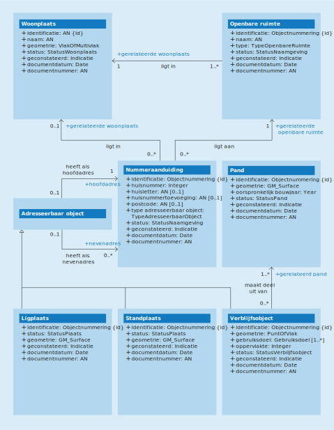

# Conceptueel model

Figuur 5.1 geeft een vereenvoudigde weergave van de conceptuele modellering van de BAG-objecttypen. De beschrijving van deze objecttypen staat in [hoofdstuk 6](modelbeschrijving.md#6-objecttypen) en die van hun eigenschappen in [hoofdstuk 7](modelbeschrijving.md#7-attributen--relaties) en [hoofdstuk 8](modelbeschrijving.md#8-domeinwaarden). De eigenschappen worden door alle BAG-objecttypen overerfd.

Objecttypen met een schuingedrukte naam zijn abstracte objecttypen. Deze komen niet als concreet object voor in een BAG-product.

<figure id="cm">
    
    <figcaption>Conceptueel gegevensmodel met objecttypen, attributen en onderlinge relaties</figcaption>
</figure>

