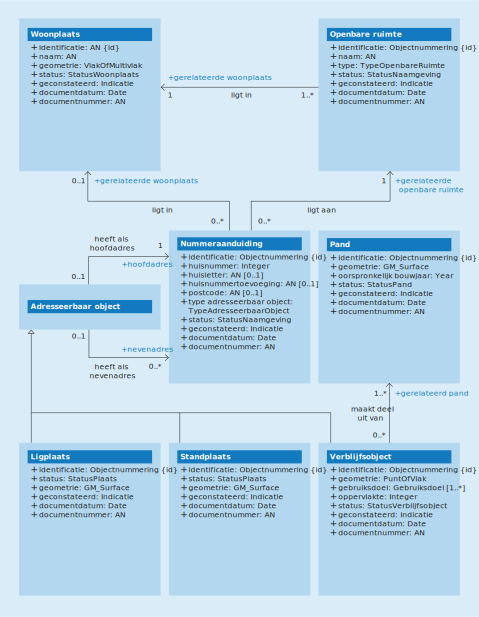

# 5 Conceptueel model
{:.no_toc}

Figuur 5.1 geeft een vereenvoudigde weergave van de conceptuele modellering van de BAG-objecttypen. De beschrijving van deze objecttypen staat in [hoofdstuk 6](objecttypen.md) en die van hun eigenschappen in [hoofdstuk 7](attributen--relaties.md) en [hoofdstuk 8](domeinwaarden.md). De eigenschappen worden door alle BAG-objecttypen overerfd.

Objecttypen met een schuingedrukte naam zijn abstracte objecttypen. Deze komen niet als concreet object voor in een BAG-product.

