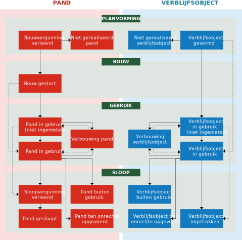

# 1 Inleiding

Deze catalogus van de Basisregistratie Adressen en Gebouwen (BAG) beschrijft hoe objectgerichte informatie over adressen en gebouwen moet worden vastgelegd, zodat landelijke uitwisseling van deze informatie mogelijk is.

Deze catalogus heeft onder meer als doelstelling om de uniformiteit in de afbakening en bijhouding van objecten te bevorderen. De generieke, objectgerichte voorschriften leiden echter niet voor iedere concrete situatie altijd tot een bij voorbaat eenduidige uitkomst. Het is de verantwoordelijkheid van de bronhouder om in dergelijke situaties tot een resultaat te komen dat aansluit bij de doelen en principes van de BAG. Daarbij kan de wens om tot een eenduidige situatie in verschillende processen en registraties te komen een punt van overweging zijn, gezien het belang daarvan voor de klanten en voor de bedrijfsvoering.

In 2018 is deze catalogus ontstaan na samenvoeging en harmonisatie van de Catalogus BAG 2009 met andere gerelateerde documenten. Hierbij zijn ook de wijzigingen meegenomen als gevolg van de aangepaste Wet basisregistratie adressen en gebouwen die op 1 juli 2018 in werking treedt.

In deze catalogus zijn de uitgangspunten en voorschriften opgenomen die ervoor zorgen dat objecten in de BAG overal op dezelfde manier worden vastgelegd. De catalogus beschrijft de ontwerpprincipes (zie [hoofdstuk 2](#2-ontwerpprincipes)) en algemene principes (zie [hoofdstuk 3](#3-algemene-principes)) die de basis vormen voor de vastlegging van objecten in de Basisregistratie Adressen en Gebouwen en de kwaliteit waaraan gegevens in de BAG moeten voldoen (zie [hoofdstuk 4](#4-gegevenskwaliteit)). De catalogus specificeert per object welke gegevens krachtens de Wet basisregistratie adressen en gebouwen in de registratie moeten worden opgenomen (zie [hoofdstuk 5](conceptueelmodel.md#5-conceptueel-model) en [hoofdstuk 6](modelbeschrijving.md#6-objecttypen)) en definieert deze gegevens (zie [hoofdstuk 7](modelbeschrijving.md#7-attributen--relaties)). Onderdeel van de gegevensdefinities vormen de domeinen, die een omschrijving geven van de waarden die een gegeven kan aannemen. De catalogus bevat ook een nadere omschrijving van deze domeinen (zie [hoofdstuk 8](modelbeschrijving.md#8-domeinwaarden)). [Hoofdstuk 9](implementatie.md#9-implementatie) richt zich op interoperabiliteit in de keten van bronhouder tot gebruiker en legt op waaraan logische modellen moeten voldoen bij het implementeren van het conceptuele model uit de hoofdstukken 5 tot en met 8. [Hoofdstuk 10](objectafbakening.md#10-objectafbakening) gaat over het kijken naar de werkelijkheid door de bril van de BAG, met de bedoeling om de objecten te herkennen waarover de BAG gegevens bijhoudt.

Dit eerste hoofdstuk geeft een samenvatting van de Basisregistratie Adressen en Gebouwen (zie [paragraaf 1.1](#11-de-basisregistratie-adressen-en-gebouwen)) en beschrijft het doel (zie [paragraaf 1.2](#12-doel)) en het gebruik ervan (zie [paragraaf 1.3](#13-gebruik)).

## 1.1 De Basisregistratie Adressen en Gebouwen

Sinds 2009 hebben gemeenten de wettelijke taak om basisgegevens over adressen en gebouwen bij te houden in de Basisregistratie Adressen en Gebouwen (BAG). Van oorsprong bestond de BAG uit twee basisregistraties: de Basisregistratie Adressen en de Basisregistratie Gebouwen. Deze twee basisregistraties waren onderling sterk gerelateerd en vormden daarom in de praktijk een geheel.

De Basisregistratie Adressen kan worden beschouwd als een overzichtstabel van alle officiële adressen die binnen de Nederlandse overheid (mogen) worden gebruikt. Op deze wijze kunnen ook knelpunten bij het koppelen van registraties worden voorkomen die het gevolg zijn van de schrijfwijze. In de Basisregistratie Adressen worden drie objecten geregistreerd die gezamenlijk een adres vormen: Woonplaats, Nummeraanduiding, Openbare ruimte.

Adressen worden daarbij aangemerkt als een vereenvoudigde officiële naamgeving van een beperkt aantal objecten.

Officiële adressen kunnen alleen worden toegekend aan de drie adresseerbare objecttypen: Verblijfsobject, Ligplaats en Standplaats.

In de Basisregistratie Gebouwen worden alle met "gebouwen" samenhangende objecten geregistreerd. De registratie is dus een objectenregistratie. Dit betekent dat in de registratie bepaalde objecten concreet worden afgebakend en van een unieke aanduiding voorzien. Het zijn deze objecten waaraan vervolgens de te registreren gegevens worden gekoppeld. In de Basisregistratie Gebouwen worden daarbij vier objecten onderscheiden: Pand, Verblijfsobject, Ligplaats en Standplaats.

Gemeenten die meer willen registreren dan de Basisregistratie Adressen en Gebouwen voorschrijft, worden daarin nadrukkelijk vrij gelaten mits de minimaal voorgeschreven verzameling van gegevens wordt bijgehouden.

In 2013-2014 heeft de Auditdienst Rijk de doeltreffendheid en de effecten van de Wet basisregistraties adressen en gebouwen geëvalueerd en aanbevelingen gedaan om de uitvoering van de Wet basisregistraties adressen en gebouwen te verbeteren[^1-1-i]. Naar aanleiding hiervan zijn verbeteringen uitgewerkt in onder meer een nieuwe Wet basisregistratie adressen en gebouwen en deze catalogus en werden de twee basisregistraties samengevoegd tot één basisregistratie: de Basisregistratie Adressen en Gebouwen (BAG).

[^1-1-i]: De Wet basisregistraties adressen en gebouwen is conform artikel 46 van deze wet in 2013 geëvalueerd door de Auditdienst Rijk in opdracht van het ministerie van Infrastructuur en Milieu. Het evaluatierapport is begin 2014 opgeleverd en op 25 april 2014 aan de Tweede Kamer verzonden. [https://www.geobasisregistraties.nl/basisregistraties/adressen-en-gebouwen/evaluatie-bag/evaluatie-onderzoek-bag-door-auditdienst-rijk](https://www.geobasisregistraties.nl/basisregistraties/adressen-en-gebouwen/evaluatie-bag/evaluatie-onderzoek-bag-door-auditdienst-rijk)

## 1.2 Doel

De Basisregistratie Adressen en Gebouwen (BAG) is een van de basisregistraties die deel uitmaakt van het landelijk stelsel van basisregistraties. Deze basisregistraties zijn erop gericht de informatievoorziening in Nederland beter te ordenen. Het eenduidig benoemen van te registreren objecten is dan ook de belangrijkste functie van een basisregistratie.

Het belangrijkste doel van de BAG is het uniek identificeren en aanduiden van adresseerbare objecten en panden. Op deze wijze ontstaat een duidelijke relatie tussen de adressering en het object waarop het adres betrekking heeft en wordt een aanzet gegeven tot het leggen van meer eenduidige relaties tussen verschillende registraties.

Registratie in de BAG heeft overigens uitdrukkelijk uitsluitend een administratieve achtergrond en houdt geen legalisering of ander (rechts)gevolg in[^1-2-i].

[^1-2-i]: Memorie van toelichting bij de wijziging van de Wet basisregistraties adressen en gebouwen en de Kadasterwet, kamerstukken II, 2008/09, 31 726, nr. 3, 7 oktober 2008: "Uitgangspunt blijft uiteraard dat registratie plaatsvindt op basis van de originele brondocumenten. Het gebruik van een formaliseringsbeslissing als brondocument dient beperkt te zijn tot die gevallen waarin er geen origineel brondocument bestaat of zo’n document slechts met onevenredige inspanning kan worden achterhaald. Het ontbreken van een brondocument kan zich bijvoorbeeld voordoen indien voor een pand geen bouwvergunning bestaat. Dit kan zeer oude, vergunningsvrije of illegale bouw betreffen. In dit verband dient uitdrukkelijk te worden opgemerkt dat een formaliseringsbeslissing in het kader van de registratie uitsluitend een administratieve achtergrond heeft en geen legalisering of ander (rechts)gevolg inhoudt. Overigens is denkbaar dat in sommige gevallen wel een brondocument heeft bestaan, dat echter door een calamiteit of anderszins teniet is gegaan." [https://zoek.officielebekendmakingen.nl/kst-31726-3.html](https://zoek.officielebekendmakingen.nl/kst-31726-3.html)

## 1.3 Gebruik

De BAG is een van de basisregistraties die de kern vormt van de gegevenshuishouding van de overheid. Binnen een dergelijke (verplicht te gebruiken) basisregistratie wordt het fundament gelegd voor de eenduidige benoeming van een aantal binnen veel overheidsprocessen gebruikte objecten. Hierdoor worden de binnen deze verschillende processen gebruikte objecten onderling consistent en kunnen gegevens uit verschillende processen zo nodig met elkaar gekoppeld en gecombineerd worden.

Naast een brede gebruiksplicht bestaat de verplichting voor bestuursorganen en de bevoegdheid voor andere belanghebbenden om bij gerede twijfel een terugmelding te doen (zie [paragraaf 4.8](#48-aanwijzingen-van-mogelijke-onjuistheden-in-de-registratie-van-objecten)). Deze combinatie van verplicht gebruik en terugmelding zijn belangrijke instrumenten om de kwaliteit van basisregistraties te vergroten.

# 2 Ontwerpprincipes

Voor de inhoud van de BAG zijn ontwerpprincipes gehanteerd met betrekking tot:

- gebouwen (zie [paragraaf 2.1](#21-gebouwen));
- adressen (zie [paragraaf 2.2](#22-adressen));
- objecten (zie [paragraaf 2.3](#23-objecten));
- brondocumenten (zie [paragraaf 2.4](#24-brondocumenten));
- de landelijke voorziening (zie [paragraaf 2.5](#25-landelijke-voorziening));
- het dekkingsgebied (zie [paragraaf 2.6](#26-dekkingsgebied));
- de modellering (zie [paragraaf 2.7](#27-modellering)).

## 2.1 Gebouwen

In tegenstelling tot hetgeen de naam van de registratie suggereert, komt er binnen de registratie geen objecttype "Gebouw" voor. De reden hiervoor is dat het begrip "gebouw" op veel plaatsen al in gebruik is voor een object dat is gedefinieerd als volledig vrijstaand. Om die reden is ervoor gekozen in plaats daarvan het begrip "pand" te hanteren.

In de BAG worden ook gegevens bijgehouden over locaties waarop met gebouwen vergelijkbare objecten permanent mogen worden geplaatst, bijvoorbeeld standplaatsen voor woonwagens en ligplaatsen voor woonboten. Om het permanente karakter van een standplaats of ligplaats te benadrukken is in de definitie vastgelegd dat er sprake dient te zijn van een door het bevoegd gezag (gemeenteraad of burgemeester en wethouders) als zodanig aangewezen plaats of locatie. Hiermee onderscheidt bijvoorbeeld een ligplaats zich van aanmeerplaatsen en afmeerplaatsen, die bedoeld zijn voor het tijdelijk aan- en afmeren van onder meer pleziervaartuigen en beroepsvaartuigen langs kades en in havens. De begrenzing van een standplaats of ligplaats vloeit voort uit de formele aanwijzing door het bevoegd gezag.

## 2.2 Adressen

Een adres in de BAG is een samenstelling van drie objecten: Woonplaats, Openbare ruimte en Nummeraanduiding. Een adres kan in de BAG niet bestaan zonder een bijbehorend adresseerbaar object: Verblijfsobject, Standplaats of Ligplaats. Deze objecten zijn de objecten waaraan formeel adressen kunnen en moeten worden toegekend. De BAG bevat daarmee alle authentieke toegekende adressen. Aan objecten die niet voldoen aan de criteria van een van deze objecttypen, kan geen authentiek adres worden toegekend.

Het adres wordt gevormd door het huisnummer, de eventuele huisletter en de eventuele huisnummertoevoeging van de nummeraanduiding, de naam van de openbare ruimte waaraan de nummeraanduiding is gerelateerd en de naam van de woonplaats waarbinnen (het grootste gedeelte van) het pand, de ligplaats of de standplaats is gelegen.

Het aanwezig zijn van een adres voor een adresseerbaar object, is van essentieel belang voor het in het maatschappelijk verkeer kunnen aanduiden van het betreffende object. Aan ieder adresseerbaar object wordt één hoofdadres toegekend. Indien aan de daaraan gestelde voorwaarden (zie paragraaf 10.2) wordt voldaan, kunnen nevenadressen toegekend worden. Daarbij geldt dat een nevenadres een eigenschap is van hetzelfde adresseerbaar object als het bijbehorende hoofdadres. Met het nevenadres wordt expliciet niet een bepaald gedeelte van een adresseerbaar object aangeduid.

## 2.3 Objecten

De BAG is een objectenregistratie. Dit betekent dat in de registratie bepaalde objecten concreet worden afgebakend en van een unieke aanduiding voorzien. Het zijn deze objecten waaraan vervolgens de te registreren gegevens worden "opgehangen". Van deze objecten worden de geometrische en/of administratieve eigenschappen vastgelegd in de BAG.

De BAG-objecten zijn te verdelen in drie groepen: adressen, adresseerbare objecten en gebouwen (zie figuur 2.3.a). Een officieel adres is samengesteld uit de objecten Woonplaats, Openbare ruimte en Nummeraanduiding. Een officieel adres wordt toegekend aan een adresseerbaar object (Verblijfsobject, Standplaats of Ligplaats).

Met betrekking tot met gebouwen samenhangende objecten wordt onderscheid gemaakt tussen panden en verblijfsobjecten. Dit onderscheid is met name ingegeven vanuit de gedachte dat beide soorten objecten een eigen karakter en een eigen dynamiek kennen. Daar waar binnen de definiëring van een verblijfsobject het samenhangende gebruik van een eenheid centraal staat, gaat het bij de definiëring van het pand om het vaststellen van een samenhangende (bouw-) constructieve eenheid.

In de BAG worden feitelijke objecten in de werkelijkheid, zoals gerealiseerde panden en verblijfsobjecten, en virtuele objecten zoals stand- en ligplaatsen en vergunde panden en verblijfsobjecten geregistreerd.

## 2.4 Brondocumenten

Elke wijziging van de gegevens in de BAG is gebaseerd op een brondocument. Ook bij constatering van een object of de correctie van gegevens is de bronhouder verplicht een brondocument op te stellen. De toegestane brondocumenten worden opgesomd in het Besluit basisregistratie adressen en gebouwen[^2-4-i]. Digitale brondocumenten en brondocumenten in de vorm van berichten zijn toegestaan. Een brondocument kan een of meer objecten en/of attributen betreffen. Brondocumenten mogen niet uit de archieven van bronhouder worden verwijderd en worden door de bronhouder dus blijvend opgeslagen, met inachtneming van de regels uit de Archiefwet[^2-4-ii].

[^2-4-i]: Besluit van 6 juli 2017 tot wijziging van het Besluit basisregistraties adressen en gebouwen in verband met modernisering en vereenvoudiging van de registratie, artikel I, onderdeel C: "Hoofdstuk 2 komt te luiden: Hoofdstuk 2. Brondocumenten. Artikel 7. Krachtens artikel 10, eerste lid, onderdeel a, van de wet worden als brondocument voor de basisregistratie aangewezen: a. een beslissing tot indeling van het grondgebied van de gemeente in een of meer woonplaatsen, alsmede de wijziging of intrekking daarvan; b. een beslissing tot vaststelling van een openbare ruimte, alsmede de wijziging of intrekking daarvan; c. een beslissing tot toekenning van een nummeraanduiding, alsmede de wijziging of intrekking daarvan; d. een document waaruit blijkt welke postcode door de organisatie die verantwoordelijk is voor de uitgifte van postcodes is toegekend aan een nummeraanduiding; e. een beslissing tot verlening van een vergunning of andere publiekrechtelijke toestemming voor het bouwen, veranderen of slopen van een pand of verblijfsobject, alsmede de wijziging of intrekking daarvan; f. een reactie van een bestuursorgaan op een melding of kennisgeving waardoor het vereiste van een vergunning of toestemming, bedoeld in onderdeel e, wordt opgeheven; g. een melding of kennisgeving van de aanvang van bouwwerkzaamheden voor nieuwbouw en het gereedkomen van bouw- of sloopwerkzaamheden voor nieuwbouw, verbouw en sloop met betrekking tot een pand of verblijfsobject; h. een beslissing tot verlening van een vergunning als bedoeld in de artikelen 21 en 22 van de Huisvestingswet 2014, alsmede de wijziging of intrekking daarvan; i. een beslissing tot vaststelling van een standplaats of ligplaats, alsmede de wijziging of intrekking daarvan; j. een beslissing tot vaststelling van een ligplaats, alsmede de wijziging of intrekking daarvan; k. een document waarin de geometrie van een pand of verblijfsobject is vastgelegd in overeenstemming met de krachtens artikel 17, tweede lid, aanhef en onderdeel a, van de wet gestelde regels; l. een rechterlijke uitspraak strekkende tot vernietiging, herroeping, intrekking of wijziging van een in een brondocument vervat besluit, en m. een verklaring van een daartoe aangewezen ambtenaar, strekkende tot: 1°. een ambtshalve correctie van een of meer gegevens in de basisregistratie op grond van een ander brondocument; 2°. een signalering van een wijziging in de feitelijke situatie die van invloed is op een of meer gegevens in de basisregistratie, die niet voortvloeit uit een ander brondocument, of 3°. een wijziging of opneming in het belang van een goede registratie van een of meer gegevens in de basisregistratie, die niet voortvloeit uit een ander brondocument." [https://zoek.officielebekendmakingen.nl/stb-2017-311.html](https://zoek.officielebekendmakingen.nl/stb-2017-311.html)

[^2-4-ii]: Archiefwet 1995. [http://wetten.overheid.nl/jci1.3:c:BWBR0007376](http://wetten.overheid.nl/jci1.3:c:BWBR0007376)

## 2.5 Landelijke voorziening

De gemeente registreert als bronhouder alle gegevens overeenkomstig de inhoud van het brondocument bij de gemeente in de basisregistratie. De gemeente levert deze gegevens door aan de landelijke voorziening, die ze bewaart en beschikbaar stelt aan afnemers.

## 2.6 Dekkingsgebied

Het werkingsgebied van de BAG is het bestuurlijk ingedeelde gebied van Nederland in Europa, oftewel de verzameling van gemeenten in Nederland. De gemeentegrens van kustgemeenten ligt op circa een kilometer uit de kust. Wat buiten de gemeentegrens ligt, wordt niet in de BAG opgenomen; wat erbinnen ligt wel.

## 2.7 Modellering

De BAG hanteert voor de modellering het nationaal metamodel voor informatiemodellering (MIM), dat is ontwikkeld door VNG Realisatie, Kadaster en Geonovum[^2-7-i]. Het conceptuele informatiemodel voor de BAG (IMBAG) wordt beschikbaar gesteld in UML[^2-7-ii]. Bij deze UML wordt een toelichting beschikbaar gesteld die beschrijft welke keuzes de BAG heeft gemaakt bij de toepassing van het MIM.

In [hoofdstukken 5](conceptueelmodel.md#5-conceptueel-model) tot en met 8 is het conceptuele informatiemodel beschreven. Hierin worden termen gebruikt zoals: objecttype, attribuutsoort, relatiesoort, relatierol, datatype, complex datatype en andere termen. Deze termen staan gedefinieerd en toegelicht in het MIM en zijn opgenomen in [bijlage A](bijlage-begrippen-afkortingen.md#bijlage-a-begrippen--afkortingen).

[^2-7-i]: Nationaal metamodel voor informatiemodellering (MIM), versie 1.0 van 14 juni 2017. [https://www.geonovum.nl/wegwijzer/standaarden/nationaal-metamodel-voor-informatiemodellering](https://www.geonovum.nl/onderwerp-artikel/nationaal-metamodel-voor-informatiemodellering)

[^2-7-ii]: De UML wordt beschikbaar gesteld in het bestandsformaat van de applicatie Enterprise Architect (.eap). [https://en.wikipedia.org/wiki/Enterprise\_Architect\_(software)](https://en.wikipedia.org/wiki/Enterprise_Architect_(software))

# 3 Algemene principes

Dit hoofdstuk beschrijft algemene principes die gelden voor de inhoud van de BAG.

Deze algemene principes hebben betrekking op:

- bronhouders (zie [paragraaf 3.1](#31-bronhouders));
- coördinatenstelsel (zie [paragraaf 3.2](#32-coördinatenstelsel));
- geometrie en oppervlakte (zie [paragraaf 3.3](#33-geometrie-en-oppervlakte));
- relaties tussen BAG-objecten (zie [paragraaf 3.4](#34-relaties-tussen-bag-objecten));
- topologie (zie [paragraaf 3.5](#35-topologie));
- levenscyclus (zie [paragraaf 3.6](#36-levenscyclus));
- identificatie en historie (zie [paragraaf 3.7](#37-identificatie-en-historie));
- gebruiksdoel (zie [paragraaf 3.8](#38-gebruiksdoel)).

## 3.1 Bronhouders

Elke gemeente is bronhouder van de BAG binnen de eigen gemeentegrenzen. Het grondgebied van de gemeente waarop een object is gelegen, bepaalt dus welke gemeente het object registreert. Het maakt hierbij geen verschil als gerelateerde objecten in een andere gemeente liggen en daarom een andere bronhouder hebben. De nummeraanduiding wordt opgevat als eigenschap van een adresseerbaar object en geregistreerd in de gemeente waarin het adresseerbare object is gelegen. In het bijzondere geval dat een pand of verblijfsobject is gelegen op de grens van twee of meer gemeenten, worden dat pand en de eventuele verblijfsobjecten geregistreerd in de gemeente op wier grondgebied het grootste gedeelte van het pand is gelegen.

## 3.2 Coördinatenstelsel

Het toegepaste coördinatenstelsel voor de BAG is dat van de Rijksdriehoeksmeting[^3-2-i] (RD-stelsel). De coördinaten zijn op de millimeter nauwkeurig en de eenheid is meter. Elk coördinaat heeft maximaal drie decimalen. Zo nodig wordt daarvoor afgerond, zodanig dat als de vierde decimaal de waarde 0, 1, 2, 3 of 4 heeft, de derde decimaal niet wijzigt en als de vierde decimaal de waarde 5, 6, 7, 8 of 9 heeft, de derde decimaal met één wordt verhoogd. Als de op te hogen decimaal de waarde 9 had (en dus 10 zou moeten worden), herhaalt deze regel zich voor de voorliggende decimalen. Bijvoorbeeld een coördinaat 155004,329098765 komt in de BAG als `155004.329` en een coördinaat 155004,329598765 als `155004.330`.

[^3-2-i]: Het stelsel van de Rijksdriehoeksmeting (RD) is het coördinatensysteem van Nederland. [http://www.kadaster.nl/web/Themas/Registraties/Rijksdriehoeksmeting/Rijksdriehoeksstelsel.htm](http://www.kadaster.nl/web/Themas/Registraties/Rijksdriehoeksmeting/Rijksdriehoeksstelsel.htm)

## 3.3 Geometrie en oppervlakte

Deze paragraaf beschrijft algemene principes die gelden voor de inhoud van de BAG en die betrekking hebben op geometrie (zie [paragraaf 3.3.1](#331-geometrie)) en op gebruiksoppervlakte (zie [paragraaf 3.3.2](#332-gebruiksoppervlakte)).

### 3.3.1 Geometrie

De geometrie is een eigenschap van vijf van de zeven BAG-objecttypen. Deze geometrie betreft het loodrechte bovenaanzicht van het object met de ware vorm, afmeting en oriëntatie en positie ten opzichte van de aarde, inclusief alle zichtbare en onzichtbare delen boven en onder de grond, maar exclusief alle delen die kunnen bewegen ten opzichte van de aarde.

De geometrische representatie van de objecttypen in de BAG, waaronder de geldige geometrietypen, de geldige ruimtelijke dimensies van de geometrie en de geldige ruimtelijke dimensies van de coördinaten van de geometrie, is afhankelijk van het objecttype (zie tabel 3.3.1.a).

| Objecttype | Geometrietype | Dimensie van de geometrie | Dimensie van de coördinaten |
| :---: | :---: | :---: | :---: |
| Nummeraanduiding | n.v.t. | n.v.t. | n.v.t. |
| Openbare ruimte | n.v.t. | n.v.t. | n.v.t. |
| Woonplaats | Vlak of multivlak | 2D | 2D |
| Ligplaats | Vlak | 2D | 2D |
| Pand | Vlak | 2D | 2D of 3D |
| Standplaats | Vlak | 2D | 2D |
| Verblijfsobject | Punt of vlak | 0D of 2D | 2D of 3D |
[Tabel 3.3.1.a: De geometrische representatie van de objecttypen in de BAG]

De geometrie van openbare ruimten is niet opgenomen in de BAG. De gemeente dient het bij het benoemen van nieuwe openbare ruimten alsmede bij het wijzigen van bestaande openbare ruimten een voldoende gedetailleerde omschrijving of grafische weergave op te nemen die de ligging van de buitenruimte op enigerlei wijze aanwijst. De ligging van openbare ruimten is dus wel opgenomen in het brondocument, maar niet in de BAG-registratie.

De geometrie van nummeraanduidingen is niet opgenomen in de BAG. De nummeraanduidingen worden opgevat als eigenschap van een adresseerbaar object, waarvan de geometrie wel is opgenomen in de BAG.

De geometrie van een BAG-object heeft tweedimensionale coördinaten bij de objecttypen Woonplaats, Standplaats en Ligplaats en allemaal twee- of allemaal driedimensionale coördinaten bij de objecttypen Pand en Verblijfsobject. Dit geldt voor elke geldige ruimtelijke dimensie van de geometrie. Elke vlakgeometrie moet een plat vlak zonder enige kromming (oftewel: planair) zijn, ook als deze driedimensionale coördinaten heeft.

Voor de beschrijving van geometrieën geldt het ISO 19107 Spatial Schema. Voor de uitwisseling wordt gebruik gemaakt van Geography Markup Language (GML) versie 3.1.1. In de BAG zijn de geometrieën conform het Simple Features profile versie 1.0 toegestaan[^3-3-1-i]. Voor de representatie van boogvormen wordt de benadering van de boog met lineaire lijnsegmenten toegepast, de zogenaamde gestrookte boog. De geometrietypen worden in het informatiemodel met hun ISO 19107-naam aangeduid (zie tabel 3.3.1.b).

| BAG-benaming | ISO 19107-naam |
| :---: | :---: |
| Punt | `GM_Point` |
| Vlak | `GM_Surface` |
| Multivlak | `GM_MultiSurface` |
[Tabel 3.3.1.b: De geometrietypen in de BAG]

[^3-3-1-i]: Open Geospatial Consortium (2011, 2012) _Geography Markup Language (GML) simple features profile (with Corrigendum)_, OGC® 10-100r3. [https://portal.opengeospatial.org/files/?artifact_id=42729](https://portal.opengeospatial.org/files/?artifact_id=42729)

### 3.3.2 Gebruiksoppervlakte

De bepaling van de gebruiksoppervlakte van een verblijfsobject geschiedt conform hetgeen in NEN 2580:2007 is vastgelegd omtrent gebruiksoppervlakte. Tot de oppervlakte van een verblijfsobject wordt uitsluitend gerekend de binnenruimte, zoals gedefinieerd in NEN 2580:2007, van een dergelijk object. In afwijking van NEN 2580:2007 maken gemeenschappelijke ruimten geen onderdeel uit van de oppervlakte van een verblijfsobject. Er dienen dus geen percentages van de oppervlakte van gemeenschappelijke ruimten te worden toegerekend aan de oppervlakte van een verblijfsobject. Als basisvoorzieningen zich bevinden in een of meer nabijgelegen ondersteunende binnenruimten die geen deel uitmaken van een verblijfsobject maar wel exclusief ondersteunend zijn aan dat verblijfsobject (zie [stap 2 van paragraaf 10.8](objectafbakening.md#2-is-er-binnen-de-ruimte-sprake-van-aaneengesloten-samenhangend-gebruik)), dan tellen de gebruiksoppervlakten van deze nabijgelegen binnenruimten met basisvoorzieningen mee voor de gebruiksoppervlakte van het verblijfsobject.

## 3.4 Relaties tussen BAG-objecten

De objecten in de BAG zijn onderling sterk aan elkaar gerelateerd. De relatie naar een ander object wordt gevormd door een verwijzing naar het identificerende attribuut. Bijvoorbeeld het identificerende attribuut van een woonplaats is de identificatie.

De BAG kent de volgende relaties tussen objecten:

- **Openbare ruimte**:
    Een openbare ruimte ligt in een woonplaats en heeft daartoe een verwijzing naar de gerelateerde woonplaats.

- **Nummeraanduiding**:
    Een nummeraanduiding is gelegen aan een openbare ruimte en heeft daartoe een verwijzing naar deze gerelateerde openbare ruimte. Op het moment dat een object is gelegen in een andere woonplaats dan de openbare ruimte waaraan de nummeraanduiding is gerelateerd, heeft de nummeraanduiding een verwijzing naar de gerelateerde Woonplaats. Een nummeraanduiding mag niet bestaan zonder het bijbehorende verblijfsobject of de bijbehorende standplaats of ligplaats.

- **Standplaats of ligplaats**:
    Een standplaats of ligplaats heeft één adres als hoofdadres en daartoe een verwijzing naar een gerelateerde nummeraanduiding, zijnde het hoofdadres. Een standplaats of ligplaats heeft eventueel een of meer adressen als nevenadres en in dat geval een verwijzing naar een of meer nummeraanduidingen, zijnde het nevenadres of de nevenadressen (zie paragraaf 10.2).

- **Verblijfsobject**:
    Een verblijfsobject heeft één adres als hoofdadres en daartoe een verwijzing naar een gerelateerde nummeraanduiding, zijnde het hoofdadres. Een verblijfsobject heeft eventueel een of meer adressen als nevenadres en in dat geval een verwijzing naar een of meer nummeraanduidingen, zijnde het nevenadres of de nevenadressen (zie paragraaf 10.2). Een verblijfsobject is gehuisvest in een of meer panden en heeft daartoe een verwijzing naar een of meer gerelateerde panden.

Bij een woonplaats of pand wordt geen identificatie naar een gerelateerd BAG-object opgenomen.

Panden hoeven geen verblijfsobjecten te bevatten. Op het moment dat er binnen een pand geen verblijfsobjecten aanwezig zijn (bijvoorbeeld een schuur in de tuin van een woning), zal dit dus betekenen dat er sprake is van een pand zonder daarbinnen gelegen verblijfsobjecten.

Hiermee ontstaat een situatie dat er verschillende soorten relaties tussen panden en verblijfsobjecten kunnen bestaan. Tabel 3.4.a laat zien welke situaties mogelijk zijn. In deze tabel staat _n_ voor twee of meer panden en _m_ voor twee of meer verblijfsobjecten.

| Pand | Verblijfsobject | Omschrijving |
| :---: | :---: | :--- |
| 1 | 0 | Een pand zonder verblijfsobjecten. De situatie waarin een gebouw ondersteunend is aan een hoofdgebouw en alleen als zodanig van belang is, zonder dat het een zelfstandige eenheid van gebruik is. Een pand zonder verblijfsobject heeft geen adres. |
| 1 | 1 | Een pand met één verblijfsobject. Dit is een veel voorkomende situatie bij bijvoorbeeld vrijstaande woningen en eengezinswoningen. |
| 1 | _m_ | Een pand met meerdere verblijfsobjecten. Dit is een veel voorkomende situatie bij bijvoorbeeld flatgebouwen met portiekwoningen of galerijwoningen. |
| _n_ | 1 | Een verblijfsobject dat zich uitstrekt over meerdere panden. Dit is een situatie die soms voorkomt bij bijvoorbeeld doorbraken van winkels tussen enkele panden. |
| _n_ | _m_ | Meerdere verblijfsobjecten die zich uitstrekken over meerdere panden. |
[Tabel 3.4.a: De mogelijke relaties tussen panden en verblijfsobjecten]

Uit deze relaties volgt ook de logische volgordelijkheid van het opvoeren van BAG-objecten in de registratie van een bronhouder:

- eerst Woonplaats en/of Openbare ruimte, daarna tegelijk Nummeraanduiding van het hoofdadres met Verblijfsobject of Standplaats of Ligplaats;
- eerst Pand, daarna Verblijfsobject;
- eerst Nummeraanduiding van het hoofdadres, daarna Nummeraanduidingen van eventuele nevenadressen.

De logische volgordelijkheid voor het afvoeren van BAG-objecten is andersom.

De nummeraanduidingen van eventuele nevenadressen ontstaan tegelijk met het hoofdadres of later en mogen worden afgevoerd terwijl het Verblijfsobject, de Standplaats of de Ligplaats blijft bestaan.

Voor de relatie tussen Pand en Verblijfsobject geldt dat de administratieve relatie leidend is boven de ruimtelijke relatie (zie paragraaf 3.5).

Voor de verwijzing naar een Woonplaats geldt dat de ruimtelijke relatie leidend is boven de administratieve relatie.

## 3.5 Topologie

Topologie beschrijft de onderlinge ruimtelijke relaties tussen de objecten, onafhankelijk van hun werkelijke positie (coördinaten). Een voorbeeld is dat een object gepositioneerd is in een ander object: 'ligt in' is dan de topologische relatie.

De BAG kent de volgende topologische relaties:

- **Pand en verblijfsobject**:
    Verblijfsobjecten maken altijd deel uit van een pand (of van meerdere panden). Een verblijfsobject moet daarom volledig binnen de een of meer panden worden gepositioneerd waarbinnen het zich bevindt. Als een verblijfsobject een puntgeometrie heeft, mag deze punt binnen het pand op een willekeurige plek staan.

- **Woonplaats en openbare ruimte**:
    Openbare ruimten moeten altijd volledig zijn gelegen binnen één woonplaats. Als een openbare ruimte door het splitsen van een woonplaats in meerdere woonplaatsen komt te liggen, wordt de openbare ruimte in elk van deze woonplaatsen afgebakend.

- **Woonplaats**:
    Het gehele grondgebied van de gemeente dient te zijn ingedeeld in woonplaatsen. De geometrieën van de woonplaatsen dienen naadloos op elkaar aan te sluiten en mogen elkaar niet overlappen, oftewel de geometrische vereniging van iedere woonplaats binnen een gemeente komt overeen met de geometrische contour van het grondgebied van deze gemeente.

## 3.6 Levenscyclus

De levenscyclus van een BAG-object beschrijft de opeenvolgende fasen in de ontwikkeling van een object. Hierbij dient de werkelijkheid zoveel mogelijk in de registratie zichtbaar te zijn. In de verschillende fasen zijn er situaties die aanleiding geven tot het wijzigen van de gegevens van het object. De fase van ontwikkeling waarin een BAG-object zich bevindt, wordt met een eigenschap _status_ bij het object geregistreerd.

In de levenscyclus van een pand en verblijfsobject wordt in hoofdlijnen een onderscheid gemaakt tussen de vier fasen planvorming, bouw, gebruik en sloop. Binnen deze fasen kunnen verschillende statussen aan het object worden toegekend. De levenscyclus van een pand of een verblijfsobject volgt meestal een logische volgorde van statussen (zie figuur 3.6.a), maar fasen in de levenscyclus mogen ook worden overgeslagen.

In de levenscycli van standplaatsen, ligplaatsen, openbare ruimten, nummeraanduidingen en woonplaatsen wordt onderscheid gemaakt tussen het benoemen en het intrekken van deze objecten.

Binnen een fase van de levenscyclus kunnen attributen worden gewijzigd, zoals het _gebruiksdoel_ bij een verblijfsobject of de geometrie van een pand.

Verder gelden de volgende regels voor het toewijzen van een status aan een object:

1. Indien voor een pand met de status `Bouwvergunning verleend` of `Bouw gestart` een nieuwe omgevingsvergunning wordt verleend, worden wel de gegevens van het pand gewijzigd conform de omgevingsvergunning, maar de status van het pand blijft ongewijzigd.
1. Indien:
    - een pand de status `Pand in gebruik (niet ingemeten)` of `Pand in gebruik` heeft bereikt, kan de status van het pand niet meer terug naar `Bouwvergunning verleend` of `Bouw gestart`, tenzij sprake is van een ten onrechte toegekende status.
    - een verblijfsobject de status `Verblijfobject in gebruik (niet ingemeten)` of `Verblijfsobject in gebruik` heeft bereikt, kan de status van het verblijfsobject niet meer terug naar `Verblijfsobject gevormd`, tenzij sprake is van een ten onrechte toegekende status.
1. Elke statusovergang is toegestaan, mits deze een correctie betreft van een ten onrechte toegekende status.
1. Als een vergunning wordt verleend voor de verbouwing van een pand en/of verblijfsobjecten, krijgen het pand en/of verblijfsobjecten die als gevolg van deze verbouwing als zodanig zullen blijven bestaan, maar waarvan een of meer gegevens in de BAG zullen wijzigen, de status `Verbouwing pand` of `Verbouwing verblijfsobject`. Als de verbouwing is afgerond, krijgt het pand de status `Pand in gebruik (niet ingemeten)` of `Pand in gebruik`, en de verblijfsobjecten de status `Verblijfsobject in gebruik (niet ingemeten)` of `Verblijfsobject in gebruik`.
1. Als een vergunning wordt verleend voor het splitsen of samenvoegen van verblijfsobjecten, worden de nieuw te realiseren Verblijfsobjecten worden opgenomen met de status `Verblijfsobject gevormd`, terwijl de 'oude' Verblijfsobjecten hun status tijdens de verbouwing behouden (meestal `Verblijfsobject in gebruik`). Als de verbouwing is afgerond, worden de 'oude' Verblijfsobjecten ingetrokken, terwijl de nieuwe Verblijfsobjecten de status `Verblijfsobject in gebruik (niet ingemeten)` of `Verblijfsobject in gebruik` krijgen zodra zij gebruiksgereed zijn.
1. Als een vergunning wordt verleend voor het toevoegen van verblijfsobjecten aan bestaande panden of een verbouwing waarbij het aantal verblijfsobjecten verandert, worden nieuwe Verblijfsobjecten opgenomen met de status `Verblijfsobject gevormd`.
1. Bij een verbouwing op een pand krijgen de eventueel aanwezige Verblijfsobjecten de status `Verbouwing verblijfsobject`, ongeacht of de pandcontouren wijzigen. Als de pandcontouren wijzigen, krijgt het Pand de status `Verbouwing pand`.
1. Indien er meerdere verbouwingen aan een pand worden verricht, krijgt het pand na voltooiing van de laatste verbouwing de status `Pand in gebruik (niet ingemeten)` of `Pand in gebruik`.
1. Indien de geometrie van een pand of verblijfsobject is ingemeten voordat de bouw is afgerond en er geen nieuwe geometrie hoeft te worden ingemeten, krijgt het pand of verblijfsobject meteen de status `Pand in gebruik` of `Verblijfsobject in gebruik` zodra het gereed is voor gebruik na afronding van de bouw.
1. Indien een verblijfsobject de status `Verblijfsobject in gebruik (niet ingemeten)` heeft gekregen, krijgen ook de een of meer panden waarin het verblijfsobject is gelegen, de status `Pand in gebruik (niet ingemeten)`.
1. Indien in een vergund pand met meerdere verblijfsobjecten een of meerdere verblijfsobjecten de status `Verblijfsobject in gebruik (niet ingemeten)` of `Verblijfsobject in gebruik` krijgen, dan krijgt het pand meteen de status `Pand in gebruik (niet ingemeten)`, respectievelijk `Pand in gebruik`.
1. De status `Sloopvergunning verleend` is zowel van toepassing op situaties waarin specifiek voor het betreffende pand een sloopvergunning is verleend, als op situaties waarin op grond van andere regelgeving geen sloopvergunning nodig is (omdat deze andere regelgeving daarmee in wezen al vergunning heeft verleend).
1. Indien een object de status `niet gerealiseerd`, `ten onrechte opgevoerd`, `gesloopt` of `ingetrokken` heeft, is het feitelijk beëindigd en kan de status niet meer worden gewijzigd. Alleen objecten die ten onrechte een van deze statussen hebben gekregen, kunnen middels een schriftelijke verklaring herleven.
1. Bij elke mutatie wordt de actuele status toegekend. Muteren in het verleden is niet toegestaan.

## 3.7 Identificatie en historie

Deze paragraaf beschrijft algemene principes die gelden voor de inhoud van de BAG en die betrekking hebben op identificatie (zie [paragraaf 3.7.1](#371-identificatie)) en op historie (zie [paragraaf 3.7.2](#372-historie)).

### 3.7.1 Identificatie

Aan elk object wordt een uniek objectnummer (_identificatie_) toegekend. Zolang het object bestaat, mag deze identificatie niet veranderen.

Bij splitsing van een woonplaats of openbare ruimte wordt alleen een daardoor nieuw ontstane (oftewel niet reeds aanwezige) woonplaats of openbare ruimte van een nieuwe identificatiecode voorzien. Dat aan een nieuw ontstaan object een identificatiecode wordt toegekend, volgt uit artikel 19, eerste lid, van de wet[^3-7-1-iii] [^3-7-1-iv] en het gewijzigde artikel 10 van het besluit[^3-7-1-v] [^3-7-1-vi]. Een bij splitsing betrokken reeds bestaande woonplaats of openbare ruimte wordt niet geacht op te houden te bestaan, maar ondergaat alleen een wijziging van de geometrie. Bij samenvoeging van twee woonplaatsen of openbare ruimten houdt de ene daarbij betrokken woonplaats of openbare ruimte op te bestaan en wijzigt de geometrie van de andere woonplaats of openbare ruimte. Bij dat laatste bekijkt de gemeente per geval welk betrokken object logischerwijs geacht wordt voort te bestaan en welk object verdwijnt.

De identificatie moet het object per bronhouder uniek identificeren. Hiervoor dient gebruik te worden gemaakt van een viercijferige objectnummering voor het objecttype Woonplaats en een zestiencijferige objectnummering voor de overige BAG-objecten.

Het viercijferige objectnummer van een woonplaats is de code die de beheerder van de landelijke voorziening toekent aan een nieuwe woonplaats. Dit gebeurt binnen twee werkdagen nadat de gemeente erom heeft verzocht[^3-7-1-i].

Het eerste deel van het zestiencijferige objectnummer bestaat uit vier numerieke posities met de gemeentecode, zoals gepubliceerd in _Tabel 33 Gemeententabel_ van de Rijksdienst voor Identiteitsgegevens[^3-7-1-ii]. De gemeentecode wordt toegekend aan de identificatie op basis van de gemeente waar het object ontstaat. Het tweede deel van het zestiencijferige objectnummer bestaat uit twee numerieke posities met de code voor het betreffende objecttype (zie tabel 3.7.1.a).

| _Objecttypecode_ | BAG-object |
| :---: | :---: |
| `01` | Verblijfsobject |
| `10` | Pand |
| `02` | Ligplaats |
| `20` | Nummeraanduiding |
| `03` | Standplaats |
| `30` | Openbare ruimte |
[Tabel 3.7.1.a: De objecttypecodes van de BAG]

Het derde deel van het zestiencijferige objectnummer bestaat uit tien numerieke posities met een binnen een gemeente uniek objectvolgnummer. Indien een objectvolgnummer uit minder dan tien posities bestaat dan dient deze ten behoeve van de uitwisseling te worden aangevuld met voorloopnullen.

Op deze wijze ziet de identificatie van een Pand (_objecttypecode_ `10`) dat is ontstaan in de gemeente Amersfoort (_gemeentecode_ `0307`) en toen _objectvolgnummer_ `367968` heeft gekregen, eruit als: `0307100000367968`.

De identificatie van een BAG-object wordt bepaald bij het ontstaan van het object en blijft behouden als het object wordt overgedragen aan een andere bronhouder, zoals bij een gemeentelijke herindeling. De gemeentecode in de identificatie kan daarom niet worden gebruikt om te bepalen binnen welke gemeente een object is gelegen.

[^3-7-1-i]:	De beheerder van de landelijke voorziening geeft de woonplaatscodes uit op grond van artikel 19 lid 3 van de Wet basisregistraties adressen en gebouwen en artikel 11 van het Besluit basisregistraties adressen en gebouwen. [http://wetten.overheid.nl/jci1.3:c:BWBR0023466](http://wetten.overheid.nl/jci1.3:c:BWBR0023466#Hoofdstuk3_Paragraaf2_Artikel19) en [http://wetten.overheid.nl/jci1.3:c:BWBR0025520#Hoofdstuk3_Artikel11](http://wetten.overheid.nl/jci1.3:c:BWBR0025520#Hoofdstuk3_Artikel11) en [http://www.kadaster.nl/web/Themas/Registraties/BAG/BAGartikelen/BAG-Woonplaatscodes.htm](http://www.kadaster.nl/web/Themas/Registraties/BAG/BAGartikelen/BAG-Woonplaatscodes.htm)

[^3-7-1-ii]: _Tabel 33 Gemeententabel_ maakt deel uit van de Landelijke Tabellen GBA. "Landelijke Tabellen zijn coderingslijsten waarin gegevens zijn opgenomen die gebruikt worden voor de bijhouding van persoonsgegevens in het geautomatiseerde systeem van de Gemeentelijke Basisadministratie Persoonsgegevens (GBA). Hoewel deze tabellen een onderdeel zijn van het Logisch Ontwerp GBA en op grond daarvan dezelfde juridische waarde bezitten, nemen ze een bijzondere plaats in. Dat komt voornamelijk omdat tabellen aan voortdurende wijziging onderhevig kunnen zijn. \[...\] De bijhouding en verspreiding van de Landelijke Tabellen wordt uitgevoerd door de Rijksdienst voor Identiteitsgegevens (RvIG)." [http://publicaties.rvig.nl/Landelijke_tabellen/Inleiding_op_de_Landelijke_Tabellen_GBA](http://publicaties.rvig.nl/Landelijke_tabellen/Inleiding_op_de_Landelijke_Tabellen_GBA)

[^3-7-1-iii]: Wet basisregistraties adressen en gebouwen, artikel 19, eerste lid: "In de basisregistratie worden een identificerend objectnummer, beschrijvende gegevens, temporele gegevens en meta-gegevens opgenomen over de in de gemeente bestaande: a. panden; b. verblijfsobjecten; c. standplaatsen, alsmede situaties als bedoeld in artikel 2, tweede lid, onderdeel b, aanhef en onder 1°; d. ligplaatsen, alsmede situaties als bedoeld in artikel 2, tweede lid, onderdeel b, aanhef en onder 2°; e. woonplaatsen, alsmede situaties als bedoeld in artikel 2, tweede lid, onderdeel b, aanhef en onder 3°; f. openbare ruimten, alsmede situaties als bedoeld in artikel 2, tweede lid, onderdeel b, aanhef en onder 4°, en g. nummeraanduidingen, alsmede situaties als bedoeld in artikel 2, tweede lid, onderdeel b, aanhef en onder 5°." [https://zoek.officielebekendmakingen.nl/stb-2017-60.html](https://zoek.officielebekendmakingen.nl/stb-2017-60.html)

[^3-7-1-iv]: Wet van 10 februari 2017 tot wijziging van de Wet basisregistraties adressen en gebouwen en enige andere wetten in verband met modernisering en vereenvoudiging van de registratie en het toezicht, artikel I, onderdeel Q, onder 19, eerste lid: "In de basisregistratie worden een identificerend objectnummer, beschrijvende gegevens, temporele gegevens en meta-gegevens opgenomen over de in de gemeente bestaande: a. panden; b. verblijfsobjecten; c. standplaatsen, alsmede situaties als bedoeld in artikel 2, tweede lid, onderdeel b, aanhef en onder 1°; d. ligplaatsen, alsmede situaties als bedoeld in artikel 2, tweede lid, onderdeel b, aanhef en onder 2°; e. woonplaatsen, alsmede situaties als bedoeld in artikel 2, tweede lid, onderdeel b, aanhef en onder 3°; f. openbare ruimten, alsmede situaties als bedoeld in artikel 2, tweede lid, onderdeel b, aanhef en onder 4°, en g. nummeraanduidingen, alsmede situaties als bedoeld in artikel 2, tweede lid, onderdeel b, aanhef en onder 5°." [https://zoek.officielebekendmakingen.nl/stb-2017-60.html](https://zoek.officielebekendmakingen.nl/stb-2017-60.html)

[^3-7-1-v]: Besluit van 6 juli 2017 tot wijziging van het Besluit basisregistraties adressen en gebouwen in verband met modernisering en vereenvoudiging van de registratie, artikel I, onderdeel G: "Artikel 10 wordt als volgt gewijzigd: 1. In het eerste lid wordt “in de artikelen 19, eerste lid, onderdeel a, 20, eerste lid, onderdeel a, 21, eerste lid, onderdeel a, 22, eerste lid, onderdeel a, 23, eerste lid, onderdeel a, 24, eerste lid, onderdeel a, en 25, eerste lid, onderdeel a, van de wet” vervangen door: bij de nummers 1.1, 2.1, 3.1, 4.1, 5.1, 6.1 en 7.1 in de bijlage bij dit besluit. 2. Het tweede en derde lid komen te luiden: 2. Indien een in de basisregistratie opgenomen verblijfsobject, standplaats of ligplaats wordt gesplitst, wordt elk van de aldus ontstane verblijfsobjecten, standplaatsen of ligplaatsen van een nieuwe identificatiecode voorzien. 3. Indien in de basisregistratie opgenomen verblijfsobjecten, standplaatsen of ligplaatsen worden samengevoegd, wordt het aldus ontstane verblijfsobject, dan wel de aldus ontstane standplaats of ligplaats van een nieuwe identificatiecode voorzien." [https://zoek.officielebekendmakingen.nl/stb-2017-311.html](https://zoek.officielebekendmakingen.nl/stb-2017-311.html)

[^3-7-1-vi]: Nota van toelichting bij het Besluit van 6 juli 2017 tot wijziging van het Besluit basisregistraties adressen en gebouwen in verband met modernisering en vereenvoudiging van de registratie, algemeen deel, artikel 2.3: "Identificatiecodes bij splitsing en samenvoeging van woonplaatsen en openbare ruimten. Bij de evaluatie van de wet is de wens geuit om bij wijzigingen van woonplaatsen alleen de geometrie te wijzigen. De regels voor wijzigingen van woonplaatsen die in het tweede en derde lid van artikel 10 van het besluit waren opgenomen, brachten onder meer mee dat in veel gevallen mutaties in de registratie moesten worden doorgevoerd die voor gebruikers de indruk wekten dat verhuizingen naar andere woonplaatsen hadden plaatsgevonden, terwijl het uitsluitend ‘administratieve verhuizingen’ betrof. Bij wijziging van openbare ruimten deed zich hetzelfde voor. Het BAG Bronhouders- en Afnemers Overleg (BAG BAO) heeft nader onderzoek laten doen naar het behoud van de identificatiecode bij geometriewijzigingen. Op basis van de resultaten is door het BAG BAO geadviseerd artikel 10 van het besluit aan te passen. Het advies houdt in dat de identificatiecode van de woonplaats alleen wordt gewijzigd in het geval van splitsing van een woonplaats, voor zover de opgesplitste delen geen deel gaan uitmaken van een andere bestaande woonplaats. Bij samenvoeging van (een deel van) een woonplaats met een andere woonplaats wordt ofwel een van de woonplaatsen opgeheven (als deze geheel met een andere woonplaats wordt samengevoegd), ofwel wijzigt alleen de geometrie van beide woonplaatsen. Op die manier leidt de wijziging van de geometrie van een bestaande woonplaats niet tot wijziging van de identificatiecode van die woonplaats. Het BAG BAO heeft hierbij tevens geadviseerd om, gezien de overeenkomsten in de aard van de problematiek, dezelfde aanpak te volgen bij wijzigingen van openbare ruimten. Gelet op het uitgebrachte advies zijn het tweede en derde lid van artikel 10 heroverwogen. Geconcludeerd is dat opvolging van het advies aanbeveling verdient. Een en ander heeft geleid tot een formulering van artikel 10 die inhoudt dat bij splitsing van een woonplaats of openbare ruimte alleen een daardoor nieuw ontstane (oftewel niet reeds aanwezige) woonplaats of openbare ruimte van een nieuwe identificatiecode wordt voorzien. Dat aan een nieuw ontstaan object een identificatiecode wordt toegekend, volgt uit artikel 19, eerste lid, van de wet en het nieuwe artikel 8 van het besluit in samenhang met de bij het besluit behorende bijlage. Een bij splitsing betrokken reeds bestaande woonplaats of openbare ruimte wordt niet geacht op te houden te bestaan, maar ondergaat alleen een wijziging van de geometrie. Bij samenvoeging van twee woonplaatsen of openbare ruimten houdt de ene daarbij betrokken woonplaats of openbare ruimte op te bestaan, en wijzigt de geometrie van de andere woonplaats of openbare ruimte. Bij dat laatste bekijkt de gemeente per geval welk betrokken object logischerwijs geacht wordt voort te bestaan en welk object verdwijnt." [https://zoek.officielebekendmakingen.nl/stb-2017-311.html](https://zoek.officielebekendmakingen.nl/stb-2017-311.html)

### 3.7.2 Historie

Deze paragraaf beschrijft hoe de BAG invulling geeft aan historie.

In de BAG worden gegevens bijgehouden van alle objecten in de BAG. Al deze gegevens worden bestendig bewaard in de registratie van bronhouders en de landelijke voorziening. Als er nieuwe gegevens worden geregistreerd, dan blijven de oude gegevens bewaard. Dit heet het bijhouden van gegevens onder historie. Het uiteindelijke doel van het bijhouden van historie is om vragen te kunnen beantwoorden zoals "welke gegevens zijn er nu geldig?", "sinds wanneer had men dit kunnen weten?" en andere vragen.

Elk object heeft kenmerken, zoals een naam, een geometrie, een status of een relatie met een ander object. Hiervan worden de gegevens bijgehouden. In de BAG is het nodig om van alle gegevens te weten wanneer ze geldig zijn of geldig zijn geworden. In de tijd kunnen deze gegevens een andere waarde krijgen. De nieuwe gegevens worden dan geregistreerd en geldig, de oude zijn dan niet meer geldig. De BAG hanteert hiervoor _materiële historie_.

Ook is het nodig om te weten wanneer de gegevens formeel in werking zijn getreden, omdat een besluit rondom de materiële geldigheid eerder of later verwerkt kan zijn. Er zit dan een grotere periode tussen wanneer een gegeven geldig is en wanneer dit is geregistreerd. De BAG hanteert hiervoor het concept _formele historie_. De BAG streeft ernaar om de materiële en formele historie dichtbij elkaar te houden, maar dit is niet altijd mogelijk.

Deze twee soorten historie dekken de juridische geldigheid van de BAG-gegevens af.

In het conceptuele informatiemodel (zie hoofdstuk 5 Conceptueel model) zijn alle kenmerken van het object opgenomen. Op deze gegevens is het bijhouden van historie (meestal) van toepassing. Per gegeven wordt daarom via een metagegeven aangegeven of het bijhouden van historie aan de orde is. Deze metagegevens specificeren we als volgt:

- **Indicatie materiële historie**:
    indicatie of de materiële historie van de attribuutsoort te bevragen is. Materiële historie geeft aan wanneer een verandering is opgetreden in de werkelijkheid die heeft geleid tot verandering van de attribuutwaarde. Materiële historie impliceert dat actuele, historische en eventuele toekomstige attribuutwaarden te bevragen zijn.

- **Indicatie formele historie**:
    indicatie of de formele historie van de attribuutsoort te bevragen is. Formele historie geeft aan wanneer in de administratie een verandering is verwerkt van de attribuutwaarde (wanneer was de verandering bekend en is deze verwerkt).

Aanvullend is het van belang wanneer gegevens vanuit de bronhouders succesvol zijn verwerkt in de landelijke voorziening, waarmee deze gegevens (binnen bepaalde termijn) beschikbaar zijn geworden voor afnemers van de landelijke voorziening. Hiervoor houdt de landelijke voorziening aanvullende datums bij.

De implementatie van historie is beschreven in [hoofdstuk 9](implementatie.md#9-implementatie).

## 3.8 Gebruiksdoel

Bij een verblijfsobject worden een of meer gebruiksdoelen opgenomen. Onder het gebruiksdoel van een verblijfsobject wordt verstaan een overzicht van de (gecategoriseerde) gebruiksdoelen die bij het verlenen van een bouw- of omgevingsvergunning aan het betreffende verblijfsobject zijn toegekend. Deze gebruiksdoelen worden ook wel aangeduid als de bouwkundige bestemming conform de categorisering van het Bouwbesluit 2012[^3-8-i].

Bij een geconstateerd verblijfsobject wordt het feitelijke gebruik als gebruiksdoel (of de gebruiksdoelen) opgenomen op grond van een document van constatering. Ook daarbij wordt de categorisering van het Bouwbesluit gevolgd. Na vaststelling van de legitimiteit van het geconstateerde verblijfsobject kan het geregistreerde gebruiksdoel zo nodig worden aangepast met gebruikmaking van die categorisering.

[^3-8-i]: Bouwbesluit 2012, artikel 1.1, tweede lid: "Voor de toepassing van de bij of krachtens dit besluit gegeven voorschriften wordt voorts verstaan onder: bijeenkomstfunctie: gebruiksfunctie voor het samenkomen van personen voor kunst, cultuur, godsdienst, communicatie, kinderopvang, het verstrekken van consumpties voor het gebruik ter plaatse of het aanschouwen van sport; bouwwerk geen gebouw zijnde: bouwwerk of gedeelte daarvan, voor zover dat geen gebouw of onderdeel daarvan is; celfunctie: gebruiksfunctie voor dwangverblijf van personen; gezondheidszorgfunctie: gebruiksfunctie voor medisch onderzoek, verpleging, verzorging of behandeling; industriefunctie: gebruiksfunctie voor het bedrijfsmatig bewerken of opslaan van materialen en goederen, of voor agrarische doeleinden; kantoorfunctie: gebruiksfunctie voor administratie; logiesfunctie: gebruiksfunctie voor het bieden van recreatief verblijf of tijdelijk onderdak aan personen; onderwijsfunctie: gebruiksfunctie voor het geven van onderwijs; overige gebruiksfunctie: niet in dit lid benoemde gebruiksfunctie voor activiteiten waarbij het verblijven van personen een ondergeschikte rol speelt; sportfunctie: gebruiksfunctie voor het beoefenen van sport; winkelfunctie: gebruiksfunctie voor het verhandelen van materialen, goederen of diensten; woonfunctie: gebruiksfunctie voor het wonen." [http://wetten.overheid.nl/jci1.3:c:BWBR0030461](http://wetten.overheid.nl/jci1.3:c:BWBR0030461#Hoofdstuk1_Paragraaf1.1_Artikel1.1_Lid2)

# 4 Gegevenskwaliteit

De kwaliteit van de gegevens die in de BAG zijn opgenomen, dient te voldoen aan de gestelde eisen.

Het hoogst denkbare kwaliteitsniveau daarbij is dat de registratie op elk moment aansluit op de feitelijke werkelijkheid (de werkelijkheid in de buitenwereld). Een dergelijk kwaliteitsniveau is in de praktijk echter niet mogelijk. Daarvoor zou elke wijziging in de buitenwereld direct in de basisregistratie moeten worden geregistreerd. In de praktijk zal er altijd sprake zijn van wijzigingen (nieuwbouw, verbouw en sloop) waarvan de gemeente niet of niet direct op de hoogte is, omdat er sprake is van illegale (ver-) bouw of sloop of omdat de bouw- of sloopactiviteiten vergunningvrij zijn.

In het kader van de BAG is daarom gekozen voor het streven naar registratie van de "gelegitimeerde werkelijkheid++".

Concreet betekent de "gelegitimeerde werkelijkheid++" dat:

1. de gegevens in de BAG overeenkomen met hetgeen is opgenomen in de brondocumenten (gelegitimeerde werkelijkheid) en;
2. er daarnaast een aantal aanvullende maatregelen (door inrichting van de processen en informatievoorziening) is genomen om ervoor te zorgen dat de gegevens in de registraties zo nauw mogelijk aansluiten op de feitelijke werkelijkheid.

Het registreren van de gelegitimeerde werkelijkheid wordt bereikt door (via de normale mutatieprocessen) gegevens uit onder meer omgevingsvergunningen, relevante meldingen en sloopvergunningen te verwerken in de registratie. Door onder meer het inrichten van procedures voor terugmeldingen en andere signalen en de verwerking daarvan in de registratie wordt ervoor gezorgd dat de "gelegitimeerde werkelijkheid++" in de registratie is vastgelegd.

De andere signalen kunnen onder meer afkomstig zijn uit mutatiesignalering via luchtfoto's of toezicht en handhaving. Tijdens de uitvoering van deze aanvullende maatregelen kunnen nieuwe of gewijzigde BAG-objecten geconstateerd worden, bijvoorbeeld een nieuw Pand of Verblijfsobject waarvoor geen regulier brondocument zoals een vergunning beschikbaar is. Dergelijke geconstateerde nieuwe objecten worden geregistreerd in de BAG met een indicatie _geconstateerd_. Voor de gegevens van geconstateerde objecten geldt geen gebruiksplicht[^4-i] (zie ook [paragraaf 4.8](#48-aanwijzingen-van-mogelijke-onjuistheden-in-de-registratie-van-objecten)). Van de gemeente wordt verwacht dat vervolgens alsnog een regulier brondocument wordt opgesteld (bijvoorbeeld een vergunning, verklaring vergunningvrij, verklaring dat het object is verwijderd), en verwerkt in de registratie, waarbij de indicatie _geconstateerd_ zal vervallen.

Voor de gegevens in de BAG gelden de volgende kwaliteitscriteria:

- volledigheid (zie [paragraaf 4.1](#41-volledigheid));
- compleetheid (zie [paragraaf 4.2](#42-compleetheid));
- juistheid (oftewel thematische nauwkeurigheid, zie [paragraaf 4.3](#43-juistheid));
- actualiteit (zie [paragraaf 4.4](#44-actualiteit));
- positionele nauwkeurigheid (zie [paragraaf 4.5](#45-positionele-nauwkeurigheid));
- oppervlaktenauwkeurigheid (zie [paragraaf 4.6](#46-oppervlaktenauwkeurigheid));
- tijd (zie [paragraaf 4.7](#47-tijd)).

[Paragraaf 4.8](#48-aanwijzingen-van-mogelijke-onjuistheden-in-de-registratie-van-objecten) beschrijft wat er moet gebeuren als er aanwijzingen zijn dat er onjuiste gegevens in de BAG zijn terechtgekomen dan wel daarin ontbreken.

Deze kwaliteitscriteria zijn uitgewerkt in kwaliteitseisen. De vermelde waarden voor kwaliteit zijn minimumwaarden. Dat wil zeggen dat de aspecten van de BAG er minimaal aan moeten voldoen.

[^4-i]: Wet basisregistraties adressen en gebouwen, artikel 35, lid 2: "Een bestuursorgaan kan een ander gegeven gebruiken dan een krachtens deze wet beschikbaar authentiek gegeven, ingeval: a. bij het desbetreffende authentieke gegeven de aanduiding als bedoeld in artikel 19, vierde lid, onderdeel a is geplaatst; b. bij het desbetreffende authentieke gegeven de aantekening «in onderzoek» is geplaatst; c. het met betrekking tot het desbetreffende authentieke gegeven een melding heeft gedaan als bedoeld in artikel 37; d. het door toepassing van het eerste lid zijn publiekrechtelijke taak niet naar behoren zou kunnen vervullen, of e. bij wettelijk voorschrift anders is bepaald dan in het eerste lid." [http://wetten.overheid.nl/jci1.3:c:BWBR0023466](http://wetten.overheid.nl/jci1.3:c:BWBR0023466#Hoofdstuk5_Paragraaf2_Artikel35) en [https://zoek.officielebekendmakingen.nl/stb-2017-60.html](https://zoek.officielebekendmakingen.nl/stb-2017-60.html)

## 4.1 Volledigheid

Alle objecten die voldoen aan de definitie van een van de BAG-objecttypen, moeten worden geregistreerd in de BAG.

Objecten die op grond van een brondocument bekend zijn bij de gemeente, worden opgenomen op basis van dat brondocument.

Objecten die in de werkelijkheid bestaan maar waarvan geen brondocument beschikbaar is, worden opgenomen op basis van een ambtelijke verklaring.

Een object wordt beëindigd in de BAG als:

- het pand of verblijfsobject ophoudt te bestaan in de werkelijkheid;
- de gemeente besluit dat de woonplaats, openbare ruimte, nummeraanduiding, standplaats of ligplaats niet meer bestaat.

Objecten waarvan het feitelijk bestaan na de invoering van de Wet basisregistratie adressen en gebouwen per 1 juli 2009 volgens een brondocument is geëindigd, zijn als zodanig herkenbaar opgenomen in de registratie.

## 4.2 Compleetheid

Alle te registreren kenmerken (attributen) van de geregistreerde objecten zijn opgenomen in de registratie (zie [hoofdstuk 6](modelbeschrijving.md#6-objecttypen)).

Alle in de BAG opgenomen gegevens zijn voorzien van een waarde, indien in deze catalogus is voorgeschreven dat het betreffende gegeven verplicht van een waarde moet zijn voorzien (zie [hoofdstuk 7](modelbeschrijving.md#7-attributen--relaties)).

De waarde van elk in de BAG opgenomen gegeven moet passen binnen de domeinwaarde die het betreffende gegeven overeenkomstig deze catalogus kan aannemen (zie [hoofdstuk 8](modelbeschrijving.md#8-domeinwaarden)).

## 4.3 Juistheid

Alle in de registratie verwerkte wijzigingen komen overeen met hetgeen daarover in het onderliggende brondocument is opgenomen.

Bij elke versie van een object in de BAG is een verwijzing opgenomen naar het brondocument waaruit blijkt welke wijziging in de verschijningsvorm van het object heeft plaatsgevonden.

Bij elke versie van een object in de BAG komt de waarde van een gewijzigd gegeven exact overeen met de waarde van dit gegeven in het bijbehorende brondocument, tenzij is bepaald dat een gegeven binnen bepaalde tolerantiegrenzen een afwijking mag kennen ten opzichte van de exacte waarde van het gegeven.

De in de BAG opgenomen gegevens die volgens de in deze catalogus opgenomen regels voor die attribuutsoort aan een nauwkeurigheidseis moeten voldoen (zie dit [hoofdstuk 4](#4-gegevenskwaliteit) en [hoofdstuk 7](modelbeschrijving.md#7-attributen--relaties)), kennen een nauwkeurigheid zoals genoemd in die nauwkeurigheidseisen.

## 4.4 Actualiteit

Actualiteit is de mate waarin de gegevens binnen een gedefinieerd tijdsinterval overeenstemmen met de werkelijke situatie. Voor de BAG betekent dit dat de actualiteit betrekking heeft op de administratieve werkelijkheid en de tijdige verwerking van brondocumenten.

De termijnen voor opnemen van gegevens in de registratie van een bronhouder zijn:

1. inschrijving van gegevens binnen vier werkdagen na de brondocumentdatum;
2. het in de registratie opnemen van de definitieve geometrie binnen zes maanden na het bij een verblijfsobject of pand registreren van de status `in gebruik (niet ingemeten)`.

Binnen vier werkdagen na het nemen van een besluit (oftewel de datum van het brondocument) moeten de gegevens zijn verwerkt in de registratie van de bronhouder. Als deze termijn van vier werkdagen wordt overschreden, moet de mutatie nog steeds worden doorgevoerd op basis van het besluit c.q. brondocument. Ook in dat geval wordt de dagtekening van het brondocument opgenomen als documentdatum van het brondocument.

Het is niet meer mogelijk de gegevens uit een eerder besluit door te voeren als een opvolgend besluit c.q. brondocument reeds is verwerkt in de registratie. Er wordt dan een verklaring opgesteld en vervolgens wordt de mutatie doorgevoerd met de besluitdatum van de verklaring als datum begin geldigheid en als documentdatum.

## 4.5 Positionele nauwkeurigheid

Bij oppervlakten en geometrie is sprake van bepaalde meetnauwkeurigheden en moet men rekening houden met bepaalde toleranties. Voor dit soort gegevens gelden dan ook toleranties ten aanzien van de exactheid van de waarden die het gegeven kan aannemen.

De BAG stelt eisen aan de positionele nauwkeurigheid van de geometrie van een pand, woonplaats, ligplaats en standplaats. Dit zijn de minimale kwaliteitseisen waaraan de geometrie van deze objecten moet voldoen. Aan de geometrie van een verblijfsobject worden geen eisen gesteld ten aanzien van de positionele nauwkeurigheid.

Afhankelijk van welke status een pand heeft, heeft een pand een voorlopige (niet-ingemeten) of een definitieve (ingemeten) geometrie. Er gelden andere kwaliteitseisen voor de voorlopige dan voor de definitieve geometrie van een pand (zie tabel 4.5.a). Een pand met status `ten onrechte opgevoerd` voldoet aan de kwaliteitseisen van de voorgaande status.

| Facet | Voorlopige, niet-ingemeten pandgeometrie | Definitieve, ingemeten pandgeometrie |
| :--- | :--- | :--- |
| Status van het pand | `Bouwvergunning verleend`; `Niet gerealiseerd pand`; `Bouw gestart`; `Pand in gebruik (niet ingemeten)`; `Verbouwing pand` | `Pand in gebruik`; `Sloopvergunning verleend`; `Pand gesloopt`; `Pand buiten gebruik` |
| Nauwkeurigheidseis | De relatieve puntprecisie[^4-5-i] bedraagt 300 cm (oftewel een afronding naar boven van de absolute puntprecisie van 200 cm) | De relatieve puntprecisie bedraagt 30 cm (oftewel een afronding naar boven van de absolute puntprecisie van 20 cm) |
| Detailleringseis | Details die meer dan 100 cm afwijken van de doorgaande gevellijn, moeten worden opgenomen | Details die meer dan 25 cm afwijken van de doorgaande gevellijn, moeten worden opgenomen. Als er sprake is van overbouw, wordt de gevellijn van de overbouw ingemeten, mits de overbouw tenminste een verdieping hoog is en tenminste een meter uitsteekt ten opzichte van de gevel op maaiveldniveau |
[Tabel 4.5.a: Verschillen tussen de kwaliteitseisen voor de voorlopige en de definitieve geometrie van een pand]

Voor de geometrie van woonplaatsen, standplaatsen en ligplaatsen geldt ten aanzien van de nauwkeurigheid en detaillering dat de relatieve puntprecisie van de omtrek 60 cm bedraagt (oftewel een afronding naar boven van de absolute puntprecisie van 40 cm). Waar een woonplaatsgrens langs een gemeentegrens loopt, moet de woonplaatsgrens bovendien zijn gelegen binnen een marge van 1 cm aan weerszijden van de gemeentegrens en mag de totale oppervlakte van de afwijkingen die zo kunnen ontstaan, niet meer bedragen dan 1 m².

De BAG hanteert voor het beschrijven van de positionele nauwkeurigheid de zogenaamde interne precisie, ook bekend onder de naam relatieve precisie. Een uitgebreide theoretische beschrijving hiervan staat in de Handleiding voor de Technische werkzaamheden van het Kadaster uit 1996[^4-5-ii] (HTW 1996). De waarden voor de minimale toegestane kwaliteit van de positionele nauwkeurigheid zijn afrondingen van de in de HTW 1996 vermelde waarden voor de lengte van de halve lange as van de relatieve standaardellips tussen twee punten in. Zo heeft de ingemeten geometrie van een Pand een positionele nauwkeurigheid van 20 cm × √2. Afgerond is dit 30 cm. Het staat bronhouders vrij om zelf hogere nauwkeurigheidseisen te hanteren.

De punten in het veld dienen te zijn ingemeten en in het bestand te zijn verwerkt volgens de regels zoals beschreven in de HTW 1996, inclusief het supplement voor detailmeting met GPS.

[^4-5-i]: De mate waarin een meet- en verwerkingsproces bij herhaling dezelfde resultaten geeft, noemt men precisie. Als een hoge precisie wordt gehaald, betekent dit dat de mogelijke fout een kleine waarde heeft. Precisie is het resultaat van inwinning en verwerking. Dat betekent dat een hoge precisie bij de inwinning vaak 'verslechtert' door inpassing in een bestaand bestand. Zo zal een terrestische inwinning die is aangesloten op een fotogrammetrisch ingewonnen bestand, de precisie verkrijgen die geldt voor het bestaande, fotogrammetrisch ingewonnen bestand. Mede om deze reden worden vaak grotere mutaties (uitbreidingsgebieden), na controle op de betrouwbaarheid van de meting door analyse van een eerste fase vereffening, geplaatst binnen het bestaande bestand en niet daarop ingepast. Dit is ook bekend onder de term "dumpen".

[^4-5-ii]: Handleiding voor de Technische werkzaamheden van het Kadaster (1996), ISBN 90-803078-1-5.

## 4.6 Oppervlaktenauwkeurigheid

Ten aanzien van de nauwkeurigheid van de oppervlakte is de maximaal toegestane afwijking in de oppervlakte van een verblijfsobject gesteld op 1,15 maal de wortel van de oppervlakte, met dien verstande dat bij objecten met een oppervlakte van 1 m² een toegestane afwijking geldt van 1 m² (100%).

De exacte wijze van bepalen van de gebruiksoppervlakte wordt beschreven in NEN 2580:2007. Op hoofdlijnen komt dit erop neer dat de gebruiksoppervlakte van een verblijfsobject wordt bepaald door hetgeen op vloerniveau wordt gemeten uitgaande van de binnenzijde van de omhullende scheidingsconstructies. Vides en schalmgaten van meer dan 4 m² blijven buiten beschouwing, evenals inspringingen en uitspringingen langs de omtrekken van minder dan 0,5 m².

Anders dan NEN 2580:2007 sluit de BAG niet-binnenruimten en gemeenschappelijke ruimten uit van de gebruiksoppervlakte.

## 4.7 Tijd

De BAG hanteert de norm ISO 8601:2004 voor het beschrijven van tijdsaspecten. De notatie van de tijd is overeenkomstig de ISO-regelgeving: `jjjj-mm-ddTuu:mm:ss.sss`. De hoofdletter `T` wordt hierbij gebruikt om de datum- en tijdcomponent te scheiden. Bijvoorbeeld: `2016-04-01T12:34:56` betekent dus _1 april 2016 om 12 uur, 34 minuten en 56 seconden_.

De kwaliteit van de tijdbeschrijving wordt beschreven met drie aspecten, te weten:

- tijdnauwkeurigheid (zie [paragraaf 4.7.1](#471-tijdnauwkeurigheid));
- tijdconsistentie (zie [paragraaf 4.7.2](#472-tijdconsistentie));
- tijdgeldigheid (zie [paragraaf 4.7.3](#473-tijdgeldigheid)).

### 4.7.1 Tijdnauwkeurigheid

Met tijdnauwkeurigheid wordt bedoeld de juistheid van de tijdswaarneming. Dit geeft de foutmarge aan in de tijdswaarneming.

De datum van het brondocument (_documentDatum_) wordt vastgelegd met de nauwkeurigheid van jaar, maand en dag. Het _bouwjaar_ van een pand wordt vastgelegd met de nauwkeurigheid van jaar.

Bij het initieel opvoeren van een pand, wordt door de gemeente een reële inschatting gemaakt van het waarschijnlijke bouwjaar van het pand. Bij het bouwkundig gereed opleveren van het pand wordt deze waarde in voorkomende gevallen aangepast. Indien in latere jaren wijzigingen aan een pand worden aangebracht, leidt dit niet tot wijziging van het bouwjaar.

Ten aanzien van de nauwkeurigheid van bouwjaren worden tolerantiegrenzen gehanteerd (zie tabel 4.7.1.a).

| Ingevuld bouwjaar | Maximaal toegestane afwijking |
| :---: | :---: |
| ≥ 1992 | 1 jaar |
| 1950 – 1991 | 2 jaar |
| 1900 – 1949 | 5 jaar |
| 1800 – 1899 | 10 jaar |
| \< 1800 | 25 jaar |
[Tabel 4.7.1.a: Toleranties voor de nauwkeurigheid van bouwjaren]

Hierbij wordt opgemerkt dat het in uitzonderlijke gevallen (vooral bij zeer oude panden) onmogelijk kan blijken te zijn om het bouwjaar binnen bovenstaande toleranties te bepalen. In die gevallen geldt "wat niet kan, kan niet" en wordt de beste schatting geregistreerd.

### 4.7.2 Tijdconsistentie

Op elk moment in de tijd moet het eenduidig helder zijn welke gegevens er geldig zijn. De BAG maakt hiervoor gebruik van materiële en formele historie (zie [paragraaf 3.7.2](#372-historie)). Dit betekent dat het in de registratie op elk moment in de formele historie eenduidig helder moet zijn wat de materiële historie is van een object. Binnen deze materiële historie moet het vervolgens eenduidig helder zijn vanaf wanneer en tot wanneer welke gegevens geldig zijn.

### 4.7.3 Tijdgeldigheid

Tijdgeldigheid is de geldigheid van de BAG-gegevens overeenkomstig de geregistreerde datum en tijd in de registratie. Voor het ontstaan, wijzigen en vervallen van objecten geldt de Nederlandse wettelijke tijd[^4-7-3-i]. Daarbij wordt in de winter de wintertijd aangehouden, oftewel Midden-Europese Tijd, en in de zomer de zomertijd, oftewel Midden-Europese Zomertijd. Om dubbele tijdstippen te voorkomen mag in de nacht van zomertijd naar wintertijd (oftewel de nacht van zaterdag op zondag in het laatste weekend van oktober wanneer de klok een uur teruggaat[^4-7-3-ii]) geen tijdstip worden toegekend aan (versies van) objecten.

[^4-7-3-i]: Wet tot nadere regeling van de wettelijke tijd, artikel 1: "1 De wettelijke tijd in Nederland is de Midden-Europese tijd. 2 Wij kunnen bij algemene maatregel van bestuur een tijdvak van het jaar bepalen, waarin de Midden-Europese Zomertijd geldt." [http://wetten.overheid.nl/jci1.3:c:BWBR0002288](http://wetten.overheid.nl/jci1.3:c:BWBR0002288#Artikel1)

[^4-7-3-ii]: Besluit van 5 december 2001 tot vaststelling van de zomertijd, artikel 2: "De Midden-Europese zomertijd vangt met ingang van 2002 aan op de laatste zondag van de maand maart om 02.00 uur en eindigt op de laatste zondag van de maand oktober om 03.00 uur." [http://wetten.overheid.nl/jci1.3:c:BWBR0013087](http://wetten.overheid.nl/jci1.3:c:BWBR0013087#Artikel2)

## 4.8 Aanwijzingen van mogelijke onjuistheden in de registratie

Ondanks het zorgvuldig registreren van alle gegevens die voortkomen uit de reguliere levenscyclus van objecten, kunnen er aanwijzingen zijn dat er onjuiste gegevens in de BAG zijn terechtgekomen dan wel daarin ontbreken. Dit soort aanwijzingen kan in elke fase van de levenscyclus naar voren komen en doorkruist feitelijk de normale levenscyclus van planvorming, bouw, gebruik en sloop dan wel vaststelling en intrekking (zie [paragraaf 3.6](#36-levenscyclus)).

Het gebruik van de basisregistraties binnen de overheid is als uitgangspunt verplicht en daarbij geldt tevens de plicht tot het terugmelden van fouten. Deze samenhangende plichten versterken de kwaliteit van de registraties.

Op het moment dat een gebruiker gerede twijfel heeft[^4-8-i] over de juistheid van een authentiek gegeven van een BAG-object of over het ontbreken van een authentiek gegeven, dient een terugmelding op dit gegeven te worden gedaan. Op dat moment vervalt voor deze gebruiker de gebruiksplicht[^4-8-ii]. Op het moment dat de bronhouder van het betreffende BAG-object de terugmelding niet binnen twee werkdagen kan afhandelen, wordt het gegeven 'in onderzoek' geplaatst en mogen alle gebruikers een ander gegeven gebruiken[^4-8-iii]. De bronhouder dient het onderzoek binnen zes maanden af te ronden en het gegeven weer 'uit onderzoek' te halen, waarna de gebruiksplicht voor dit gegeven weer geldt.

Als blijkt dat de waarde uit de terugmelding een hogere kwaliteit heeft dan die in de BAG, dan past de bronhouder het gegeven aan, ook als het verschil kleiner is dan de toegestane tolerantie op dit gegeven zoals gesteld in [hoofdstuk 4](#4-gegevenskwaliteit) van deze catalogus (bijvoorbeeld voor geometrie of oppervlakte).

Voor ieder BAG-object geldt dat de authentieke gegevens m.u.v. de unieke aanduiding (_identificatie_) in onderzoek geplaatst kunnen worden, uitgebreid met het gegeven _postcode_ van een nummeraanduiding. Tabel 4.8.a geeft per object aan welke gegevens (attributen en relaties) in onderzoek kunnen worden geplaatst.

| BAG-Object | Gegevens in onderzoek te plaatsen |
| :--- | :--- |
| Woonplaats | `naam`; `geometrie`; `status` |
| Openbare ruimte | `naam`; `type`; `status`; `ligt in gerelateerde woonplaats`|
| Nummeraanduiding | `huisnummer`; `huisletter`; `huisnummertoevoeging`; `postcode`; `type adresseerbaar object`; `status`; `ligt in gerelateerde woonplaats`; `ligt aan gerelateerde openbare ruimte` |
| Pand | `geometrie`; `bouwjaar`; `status` |
| Verblijfsobject | `geometrie`; `gebruiksdoel`; `oppervlakte`; `status`; `maakt onderdeel uit van gerelateerd pand`; `heeft als hoofdadres`; `heeft als nevenadres` |
| Standplaats | `geometrie`; `status`; `heeft als hoofdadres`; `heeft als nevenadres` |
| Ligplaats | `geometrie`; `status`; `heeft als hoofdadres`; `heeft als nevenadres` |
[Tabel 4.8.a: De gegevens die per object in onderzoek kunnen worden geplaatst]

[^4-8-i]: Een bestuursorgaan dat gegevens heeft verkregen uit de landelijke voorziening en gerede twijfel heeft over de juistheid van een authentiek gegeven of het ontbreken van een authentiek gegeven is op grond van artikel 37 van de Wet basisregistraties adressen en gebouwen verplicht tot terugmelden. Belanghebbenden mogen terugmelden op grond van artikel 38. [http://wetten.overheid.nl/jci1.3:c:BWBR0023466](http://wetten.overheid.nl/jci1.3:c:BWBR0023466#Hoofdstuk6_Artikel37)

[^4-8-ii]: Wet basisregistraties adressen en gebouwen, artikel 35, lid 2: "Een bestuursorgaan kan een ander gegeven gebruiken dan een krachtens deze wet beschikbaar authentiek gegeven, ingeval: a. bij het desbetreffende authentieke gegeven de aanduiding als bedoeld in artikel 19, vierde lid, onderdeel a is geplaatst; b. bij het desbetreffende authentieke gegeven de aantekening «in onderzoek» is geplaatst; c. het met betrekking tot het desbetreffende authentieke gegeven een melding heeft gedaan als bedoeld in artikel 37; d. het door toepassing van het eerste lid zijn publiekrechtelijke taak niet naar behoren zou kunnen vervullen, of e. bij wettelijk voorschrift anders is bepaald dan in het eerste lid." [http://wetten.overheid.nl/jci1.3:c:BWBR0023466](http://wetten.overheid.nl/jci1.3:c:BWBR0023466#Hoofdstuk5_Paragraaf2_Artikel35) en [https://zoek.officielebekendmakingen.nl/stb-2017-60.html](https://zoek.officielebekendmakingen.nl/stb-2017-60.html)

[^4-8-iii]: Wet basisregistraties adressen en gebouwen, artikel 35, lid 2: "Een bestuursorgaan kan een ander gegeven gebruiken dan een krachtens deze wet beschikbaar authentiek gegeven, ingeval: a. bij het desbetreffende authentieke gegeven de aanduiding als bedoeld in artikel 19, vierde lid, onderdeel a is geplaatst; b. bij het desbetreffende authentieke gegeven de aantekening «in onderzoek» is geplaatst; c. het met betrekking tot het desbetreffende authentieke gegeven een melding heeft gedaan als bedoeld in artikel 37; d. het door toepassing van het eerste lid zijn publiekrechtelijke taak niet naar behoren zou kunnen vervullen, of e. bij wettelijk voorschrift anders is bepaald dan in het eerste lid." [http://wetten.overheid.nl/jci1.3:c:BWBR0023466](http://wetten.overheid.nl/jci1.3:c:BWBR0023466#Hoofdstuk5_Paragraaf2_Artikel35) en [https://zoek.officielebekendmakingen.nl/stb-2017-60.html](https://zoek.officielebekendmakingen.nl/stb-2017-60.html)
