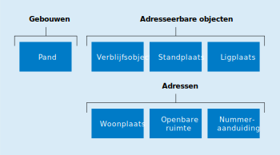

# Ontwerpprincipes

Voor de inhoud van de BAG zijn ontwerpprincipes gehanteerd met betrekking tot:

- gebouwen (zie [paragraaf 2.1](#21-gebouwen));
- adressen (zie [paragraaf 2.2](#22-adressen));
- objecten (zie [paragraaf 2.3](#23-objecten));
- brondocumenten (zie [paragraaf 2.4](#24-brondocumenten));
- de landelijke voorziening (zie [paragraaf 2.5](#25-landelijke-voorziening));
- het dekkingsgebied (zie [paragraaf 2.6](#26-dekkingsgebied));
- de modellering (zie [paragraaf 2.7](#27-modellering)).

## Gebouwen

In tegenstelling tot hetgeen de naam van de registratie suggereert, komt er binnen de registratie geen objecttype "Gebouw" voor. De reden hiervoor is dat het begrip "gebouw" op veel plaatsen al in gebruik is voor een object dat is gedefinieerd als volledig vrijstaand. Om die reden is ervoor gekozen in plaats daarvan het begrip "pand" te hanteren.

In de BAG worden ook gegevens bijgehouden over locaties waarop met gebouwen vergelijkbare objecten permanent mogen worden geplaatst, bijvoorbeeld standplaatsen voor woonwagens en ligplaatsen voor woonboten. Om het permanente karakter van een standplaats of ligplaats te benadrukken is in de definitie vastgelegd dat er sprake dient te zijn van een door het bevoegd gezag (gemeenteraad of burgemeester en wethouders) als zodanig aangewezen plaats of locatie. Hiermee onderscheidt bijvoorbeeld een ligplaats zich van aanmeerplaatsen en afmeerplaatsen, die bedoeld zijn voor het tijdelijk aan- en afmeren van onder meer pleziervaartuigen en beroepsvaartuigen langs kades en in havens. De begrenzing van een standplaats of ligplaats vloeit voort uit de formele aanwijzing door het bevoegd gezag.

## Adressen

Een adres in de BAG is een samenstelling van drie objecten: Woonplaats, Openbare ruimte en Nummeraanduiding. Een adres kan in de BAG niet bestaan zonder een bijbehorend adresseerbaar object: Verblijfsobject, Standplaats of Ligplaats. Deze objecten zijn de objecten waaraan formeel adressen kunnen en moeten worden toegekend. De BAG bevat daarmee alle authentieke toegekende adressen. Aan objecten die niet voldoen aan de criteria van een van deze objecttypen, kan geen authentiek adres worden toegekend.

Het adres wordt gevormd door het huisnummer, de eventuele huisletter en de eventuele huisnummertoevoeging van de nummeraanduiding, de naam van de openbare ruimte waaraan de nummeraanduiding is gerelateerd en de naam van de woonplaats waarbinnen (het grootste gedeelte van) het pand, de ligplaats of de standplaats is gelegen.

Het aanwezig zijn van een adres voor een adresseerbaar object, is van essentieel belang voor het in het maatschappelijk verkeer kunnen aanduiden van het betreffende object. Aan ieder adresseerbaar object wordt één hoofdadres toegekend. Indien aan de daaraan gestelde voorwaarden (zie paragraaf 10.2) wordt voldaan, kunnen nevenadressen toegekend worden. Daarbij geldt dat een nevenadres een eigenschap is van hetzelfde adresseerbaar object als het bijbehorende hoofdadres. Met het nevenadres wordt expliciet niet een bepaald gedeelte van een adresseerbaar object aangeduid.

## Objecten

De BAG is een objectenregistratie. Dit betekent dat in de registratie bepaalde objecten concreet worden afgebakend en van een unieke aanduiding voorzien. Het zijn deze objecten waaraan vervolgens de te registreren gegevens worden "opgehangen". Van deze objecten worden de geometrische en/of administratieve eigenschappen vastgelegd in de BAG.

De BAG-objecten zijn te verdelen in drie groepen: adressen, adresseerbare objecten en gebouwen (zie figuur 2.3.a). Een officieel adres is samengesteld uit de objecten Woonplaats, Openbare ruimte en Nummeraanduiding. Een officieel adres wordt toegekend aan een adresseerbaar object (Verblijfsobject, Standplaats of Ligplaats).

Met betrekking tot met gebouwen samenhangende objecten wordt onderscheid gemaakt tussen panden en verblijfsobjecten. Dit onderscheid is met name ingegeven vanuit de gedachte dat beide soorten objecten een eigen karakter en een eigen dynamiek kennen. Daar waar binnen de definiëring van een verblijfsobject het samenhangende gebruik van een eenheid centraal staat, gaat het bij de definiëring van het pand om het vaststellen van een samenhangende (bouw-) constructieve eenheid.

In de BAG worden feitelijke objecten in de werkelijkheid, zoals gerealiseerde panden en verblijfsobjecten, en virtuele objecten zoals stand- en ligplaatsen en vergunde panden en verblijfsobjecten geregistreerd.

## Brondocumenten

Elke wijziging van de gegevens in de BAG is gebaseerd op een brondocument. Ook bij constatering van een object of de correctie van gegevens is de bronhouder verplicht een brondocument op te stellen. De toegestane brondocumenten worden opgesomd in het Besluit basisregistratie adressen en gebouwen[^2-4-i]. Digitale brondocumenten en brondocumenten in de vorm van berichten zijn toegestaan. Een brondocument kan een of meer objecten en/of attributen betreffen. Brondocumenten mogen niet uit de archieven van bronhouder worden verwijderd en worden door de bronhouder dus blijvend opgeslagen, met inachtneming van de regels uit de Archiefwet[^2-4-ii].

[^2-4-i]: Besluit van 6 juli 2017 tot wijziging van het Besluit basisregistraties adressen en gebouwen in verband met modernisering en vereenvoudiging van de registratie, artikel I, onderdeel C: "Hoofdstuk 2 komt te luiden: Hoofdstuk 2. Brondocumenten. Artikel 7. Krachtens artikel 10, eerste lid, onderdeel a, van de wet worden als brondocument voor de basisregistratie aangewezen: a. een beslissing tot indeling van het grondgebied van de gemeente in een of meer woonplaatsen, alsmede de wijziging of intrekking daarvan; b. een beslissing tot vaststelling van een openbare ruimte, alsmede de wijziging of intrekking daarvan; c. een beslissing tot toekenning van een nummeraanduiding, alsmede de wijziging of intrekking daarvan; d. een document waaruit blijkt welke postcode door de organisatie die verantwoordelijk is voor de uitgifte van postcodes is toegekend aan een nummeraanduiding; e. een beslissing tot verlening van een vergunning of andere publiekrechtelijke toestemming voor het bouwen, veranderen of slopen van een pand of verblijfsobject, alsmede de wijziging of intrekking daarvan; f. een reactie van een bestuursorgaan op een melding of kennisgeving waardoor het vereiste van een vergunning of toestemming, bedoeld in onderdeel e, wordt opgeheven; g. een melding of kennisgeving van de aanvang van bouwwerkzaamheden voor nieuwbouw en het gereedkomen van bouw- of sloopwerkzaamheden voor nieuwbouw, verbouw en sloop met betrekking tot een pand of verblijfsobject; h. een beslissing tot verlening van een vergunning als bedoeld in de artikelen 21 en 22 van de Huisvestingswet 2014, alsmede de wijziging of intrekking daarvan; i. een beslissing tot vaststelling van een standplaats of ligplaats, alsmede de wijziging of intrekking daarvan; j. een beslissing tot vaststelling van een ligplaats, alsmede de wijziging of intrekking daarvan; k. een document waarin de geometrie van een pand of verblijfsobject is vastgelegd in overeenstemming met de krachtens artikel 17, tweede lid, aanhef en onderdeel a, van de wet gestelde regels; l. een rechterlijke uitspraak strekkende tot vernietiging, herroeping, intrekking of wijziging van een in een brondocument vervat besluit, en m. een verklaring van een daartoe aangewezen ambtenaar, strekkende tot: 1°. een ambtshalve correctie van een of meer gegevens in de basisregistratie op grond van een ander brondocument; 2°. een signalering van een wijziging in de feitelijke situatie die van invloed is op een of meer gegevens in de basisregistratie, die niet voortvloeit uit een ander brondocument, of 3°. een wijziging of opneming in het belang van een goede registratie van een of meer gegevens in de basisregistratie, die niet voortvloeit uit een ander brondocument." [https://zoek.officielebekendmakingen.nl/stb-2017-311.html](https://zoek.officielebekendmakingen.nl/stb-2017-311.html)

[^2-4-ii]: Archiefwet 1995. [http://wetten.overheid.nl/jci1.3:c:BWBR0007376](http://wetten.overheid.nl/jci1.3:c:BWBR0007376)

## Landelijke voorziening

De gemeente registreert als bronhouder alle gegevens overeenkomstig de inhoud van het brondocument bij de gemeente in de basisregistratie. De gemeente levert deze gegevens door aan de landelijke voorziening, die ze bewaart en beschikbaar stelt aan afnemers.

## Dekkingsgebied

Het werkingsgebied van de BAG is het bestuurlijk ingedeelde gebied van Nederland in Europa, oftewel de verzameling van gemeenten in Nederland. De gemeentegrens van kustgemeenten ligt op circa een kilometer uit de kust. Wat buiten de gemeentegrens ligt, wordt niet in de BAG opgenomen; wat erbinnen ligt wel.

## Modellering

De BAG hanteert voor de modellering het nationaal metamodel voor informatiemodellering (MIM), dat is ontwikkeld door VNG Realisatie, Kadaster en Geonovum[^2-7-i]. Het conceptuele informatiemodel voor de BAG (IMBAG) wordt beschikbaar gesteld in UML[^2-7-ii]. Bij deze UML wordt een toelichting beschikbaar gesteld die beschrijft welke keuzes de BAG heeft gemaakt bij de toepassing van het MIM.

In [hoofdstukken 5](conceptueelmodel.md#5-conceptueel-model) tot en met 8 is het conceptuele informatiemodel beschreven. Hierin worden termen gebruikt zoals: objecttype, attribuutsoort, relatiesoort, relatierol, datatype, complex datatype en andere termen. Deze termen staan gedefinieerd en toegelicht in het MIM en zijn opgenomen in [bijlage A](bijlage-begrippen-afkortingen.md#bijlage-a-begrippen--afkortingen).

[^2-7-i]: Nationaal metamodel voor informatiemodellering (MIM), versie 1.0 van 14 juni 2017. [https://www.geonovum.nl/wegwijzer/standaarden/nationaal-metamodel-voor-informatiemodellering](https://www.geonovum.nl/onderwerp-artikel/nationaal-metamodel-voor-informatiemodellering)

[^2-7-ii]: De UML wordt beschikbaar gesteld in het bestandsformaat van de applicatie Enterprise Architect (.eap). [https://en.wikipedia.org/wiki/Enterprise\_Architect\_(software)](https://en.wikipedia.org/wiki/Enterprise_Architect_(software))
